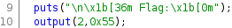

# CTF Name

 

**05 April, 12:00 EDT — 07 April, 12:00 EDT**

```
Test your security skills in a two-day Capture-the-Flag
competition, with the chance to win a $1,000 cash
scholarship and up to $21k of certified cybersecurity
training.
```

[](https://cyber-fasttrack.org/)

## Challenges

### Binary

- [BE01](#be01)
- [BE02](#be02)
- [BM01](#bm01)
- [BM02](#bm02)
- [BM03](#bm03)
- [BH01](#bh01)
- [BX01](#bx01)
- [BX02](#bx02)

### Crypto

- [CM01](#cm01)
- [CM02](#cm02)
- [CH01](#ch01)
- [CH02](#ch02)
- [CX01](#cx01)

### Forensics

- [FE02](#fe02)
- [FE03](#fe03)
- [FE04](#fe04)
- [FM01](#fm01)
- [FM02](#fm02)
- [FM03](#fm03)
- [FH01](#fh01)

### Networking

- [NE01](#ne01)
- [NM01](#nm01)

## To Do

- [ ] FE01
- [ ] WE01
- [ ] WE02
- [ ] WM01
- [ ] WM02
- [ ] WM03
- [ ] WM04
- [ ] WM05
- [ ] WH01
- [ ] WH02
- [ ] WX01

---

## BE01


**Challenge Category**


**Challenge Description**

```
Download the file and find a way to get the flag.
```

**Challenge Files**

[be01.zip](files/be01/be01.zip)

**Flag**

```
wh1ch_came_f1rst?
```

### Solution

For this challenge, we are provided with a file, [chicken.pdf](files/be01/chicken.pdf). If we run `binwalk` on it, we see there is a file hidden within named `egg.zip`.

```bash
$ binwalk chicken.pdf

DECIMAL       HEXADECIMAL     DESCRIPTION
--------------------------------------------------------------------------------
0             0x0             PDF document, version: "1.4"
72            0x48            Zip archive data, at least v1.0 to extract, compressed size: 550522, uncompressed size: 550522, name: egg.zip
550609        0x866D1         End of Zip archive, footer length: 22
551319        0x86997         Zlib compressed data, default compression
6478358       0x62DA16        Zlib compressed data, default compression
6478601       0x62DB09        End of Zip archive, footer length: 22
```

We can use `binwalk` again to extract the embedded file.

```bash
binwalk -qe chicken.pdf
```

If we look at the contents of `egg.zip`, we see a file named `chicken.zip`.

```bash
$ ls _chicken.pdf.extracted
48.zip  62DA16  62DA16.zlib  86997  86997.zlib  egg.zip

$ unzip -l _chicken.pdf.extracted/egg.zip
Archive:  _chicken.pdf.extracted/egg.zip
  Length      Date    Time    Name
---------  ---------- -----   ----
   550366  2020-10-26 15:45   chicken.zip
---------                     -------
   550366                     1 file
```

Based on the filenames, `chicken` and `egg`, we can probably assume this goes on for a bit. We can use the `-M` option to recursively extract the files for us.

```bash
binwalk -Meq chicken.pdf
```

One of the extracted files is [egg.pdf](files/be01/egg.pdf). View the pdf to retrieve the flag.

---

## BE02


**Challenge Category**


**Challenge Description**

```
Download the file and find a way to get the flag.
```

**Challenge Files**

[be02.zip](files/be02/be02.zip)

**Flag**

```
luckyNumber13
```

### Solution

For this challenge, we are provided with a file named `rot13`.

```bash
$ ./rot13
===================================
ROT IN sHELL :: ROT13's your input!
===================================
>
```

Retrieve the flag by causing a segmentation fault.

```bash
$ python -c "print('A'*33)" | ./rot13
===================================
ROT IN sHELL :: ROT13's your input!
===================================
>
Segmentation fault.
*** stack smashing detected ***: <unknown> terminated
Aborted (core dumped)

Flag: luckyNumber13
```

---

## BM01


**Challenge Category**


**Challenge Description**

```
Download the file and find a way to get the flag.
```

**Challenge Files**

[bm01.zip](files/bm01/bm01.zip)

**Flag**

```
wh1te%BluE$R3d
```

### Solution

For this challenge, we are provided with a file named `program`. If we run it, we see:

```bash
$ ./program
Какой пароль？
>
неверный.
```

To solve this challenge, we can load the program into `Ghidra` and analyze the `main` function. If we look in the decompiled code of the `main` function, we see this:


The program is looking for `молоток123` as an input. We can use this to retrieve the flag.

```bash
$ ./program
Какой пароль？
> молоток123
верный!

флаг: wh1te%BluE$R3d
```

---

## BM02


**Challenge Category**


**Challenge Description**

```
Download the file and find a way to get the flag.
```

**Challenge Files**

[bm02.zip](files/bm02/bm02.zip)

**Flag**

```
patchItFixIt
```

### Solution

This time, when we run the challenge binary, we get this:

```bash
$ ./program
I'm not going to make it that easy for you.
```

When we analyze it in `Ghidra`, we see an unused function named `printFlag`.


While analyzing the `printFlag` function, we see this:


The `printFlag` function is looking for a value of `0x539` or `1337`. We can retrieve the flag by calling `printFlag` from `gdb`.

```bash
$ gdb -q program
Reading symbols from program...
(No debugging symbols found in program)
(gdb) break main
Breakpoint 1 at 0x7e7
(gdb) run
Starting program: program

Breakpoint 1, 0x00005555554007e7 in main ()
(gdb) call (void)printFlag(1337)
Flag: patchItFixIt
```

---

## BM03


**Challenge Category**


**Challenge Description**

```
Download the file and find a way to get the flag.
```

**Challenge Files**

[bm03.zip](files/bm03/bm03.zip)

**Flag**

```
debugging_ftw
```

### Solution

When we try to run this program, we see:

```bash
$ ./flag

 Flag:
       __       __                          _                      ____ __
  ____/ /___   / /_   __  __ ____ _ ____ _ (_)____   ____ _       / __// /_ _      __
 Error displaying rest of flag
```

While analyzing the program in `Ghidra`, we see the flag being printed with a function called `output`:



If we look at the `output` function, we can see why the program has an error displaying the flag.


The `rows` variable is declared by the first parameter of the `output` function. We can retrieve the flag by calling the `output` function with a value of 6 or higher for the first parameter.

```bash
$ gdb -q flag
Reading symbols from flag...
(gdb) break main
Breakpoint 1 at 0x8d5: file flag.c, line 30.
(gdb) run
Starting program: flag

Breakpoint 1, main () at flag.c:30
30      flag.c: No such file or directory.
(gdb) call (void)output(6, 0x55)
       __       __                          _                      ____ __
  ____/ /___   / /_   __  __ ____ _ ____ _ (_)____   ____ _       / __// /_ _      __
 / __  // _ \ / __ \ / / / // __ `// __ `// // __ \ / __ `/      / /_ / __/| | /| / /
/ /_/ //  __// /_/ // /_/ // /_/ // /_/ // // / / // /_/ /      / __// /_  | |/ |/ /
\__,_/ \___//_.___/ \__,_/ \__, / \__, //_//_/ /_/ \__, /______/_/   \__/  |__/|__/
                          /____/ /____/           /____//_____/
```

---

## BH01


**Challenge Category**


**Challenge Description**

```
Download the file and find a way to get the flag.
```

**Challenge Files**

[bh01.zip](files/bh01/bh01.zip)

**Flag**

```
aLittLeObfuScatIonalCharActEr
```

### Solution

When we run this program, it asks for some input. After you provide input, it spits out some garbled nonsense back at you:

```bash
$ ./program
What is the magic word?

�:�lO?d#����*����E
Did you understand that?
```

Let's open it up in `Ghidra` to see what's going on. After renaming/retyping some variables, we get something that looks like this:


which (very) roughly translates to this pseudocode:

```
setRandomSeed()
indexList = [0x16, 0x12, 0x0a, 0x05, 0x18]
print "What is the magic word?"
input = getUserInput()
flag = 0x103f4f6c803a05b69f2abbb5f5e62364982b00094580efba3f4675fb93f9dfb21afcba39
randomCharFromInput = input[randomChoice(indexList)]
i = 0
while i < (randomCharFromInput - 0x5a):
    // complicated flag obfuscation nonsense
    if (randomCharFromInput - 0x5a) < 0:
        break
    // more complicated flag obfuscation nonsense
    i++
print flag
print "Did you understand that?"
```

There are two lines in this code that tells us how to solve the challenge. The first line is:

```
randomCharFromInput = input[randomChoice(indexList)]
```

This tells us that the program picks a random character from our input based on the list of indexes.

The second line we need to pay attention to is:

```
while i < (randomCharFromInput - 0x5a):
```

This tells us that amount of iterations the while loop will run for is based on our value of `randomCharFromInput - 0x5a`. Since we know our flag is 36 characters long, we need the loop to run for 36 iterations to completely decrypt our flag. This means randomCharFromInput needs to be the ascii character of `36 + 0x5a`, or `~`.

If we put this all together, as long as we have `~` at indexes 5, 10, 18, 22, or 24, we are guaranteed to decrypt the entire flag every time.

```bash
$ python -c "print('~'*25)" | ./program
What is the magic word?
Flag: aLittLeObfuScatIonalCharActEr
Did you understand that?
```

---

## BX01


**Challenge Category**


**Challenge Description**

```
Access the network service at url: cfta-bx01.allyourbases.co and port: 8012 and find a way to get the flag by formatting a valid request.
```

**Flag**

```
AlOnGSeaRcHFoROverWriTe
```

### Solution

When we connect to the remote host, we get this:

```bash
$ nc cfta-bx01.allyourbases.co 8012
Processing request...
Exception: angle brackets not terminated.
```

The exception is telling us that there is an open `<` without a matching `>`. We can solve this level by brute forcing closing brackets until we retrieve the flag.

```python
#!/usr/bin/env python3
from pwn import *


context.log_level = 'warning'
def connect(host, port):
    conn = remote(host, port)
    conn.recvuntil(b'angle brackets not terminated.\n')
    return conn

def terminatebrackets():
    i  = 1
    while True:
        r = connect(host, port)
        r.sendline(b'>' * i)
        if (data:=r.recvall()) and b"Error:" not in data:
            return data
        i += 1


if __name__ == '__main__':
    host = 'cfta-bx01.allyourbases.co'
    port = 8012
    response = terminatebrackets()
    print(response.decode())
```

---

## BX02


**Challenge Category**


**Challenge Description**

```
Access the network service at url: cfta-bx02.allyourbases.co port: 8013 and find a way to get the flag.
```

**Flag**

```
ThIsOneIsAbITFuZZy-6y
```

### Solution

When we connect to the host, we see this:

```bash
$ nc cfta-bx02.allyourbases.co 8013
Come Fuzz Me Bro.
DEBUG: Waiting 100ms

DEBUG: Input length too large.
```

Let's try sending every character from `\x00` to `\xff` to see if the server responds differently to any of them:

```bash
$ for i in {0..255}; do echo $(printf '\\x%02x' $i) | timeout 3 nc cfta-bx02.allyourbases.co 8013 | grep -q "Input length too large." || echo "$(printf '\\\\x%02x\t\\x%02x' $i $i)"; done
\x23    #
```

Looks like `#` receives a different message. Let's see what happens when we send a `#`:

```bash
$ nc cfta-bx02.allyourbases.co 8013
Come Fuzz Me Bro.
DEBUG: Waiting 100ms
#
DEBUG: Waiting 100ms
```

Instead of saying the input length is too large, it continues to wait for more input... So let's give it more input:

```bash
$ python -c "print('#'*2500)" | nc cfta-bx02.allyourbases.co 8013
Come Fuzz Me Bro.
DEBUG: Waiting 100ms
DEBUG: Waiting 100ms
DEBUG: Waiting 100ms
DEBUG: Waiting 100ms
DEBUG: Waiting 100ms
DEBUG: Waiting 100ms
DEBUG: Waiting 100ms
DEBUG: Waiting 100ms
DEBUG: Waiting 100ms
DEBUG: Waiting 100ms
DEBUG: Waiting 100ms
DEBUG: Waiting 100ms
DEBUG: Waiting 100ms
DEBUG: Waiting 100ms
DEBUG: Input length too large.
ERROR: Expected userID Variable of 1.
DEBUG: Waiting 100ms
DEBUG: Waiting 100ms
DEBUG: Waiting 100ms
DEBUG: Waiting 100ms
```

Interesting... We get a different error this time. Let's walk it back to try to figure out when this error occurs.

```bash
$ python -c "print('#'*2250)" | nc cfta-bx02.allyourbases.co 8013
...
$ python -c "print('#'*2000)" | nc cfta-bx02.allyourbases.co 8013
...
$ python -c "print('#'*2006)" | nc cfta-bx02.allyourbases.co 8013
Come Fuzz Me Bro.
DEBUG: Waiting 100ms
DEBUG: Waiting 100ms
DEBUG: Waiting 100ms
DEBUG: Waiting 100ms
DEBUG: Waiting 100ms
DEBUG: Waiting 100ms
DEBUG: Waiting 100ms
DEBUG: Waiting 100ms
DEBUG: Waiting 100ms
DEBUG: Waiting 100ms
DEBUG: Waiting 100ms
DEBUG: Waiting 100ms
DEBUG: Waiting 100ms
DEBUG: Waiting 100ms
DEBUG: Input length too large.
ERROR: Expected userID Variable of 1.
DEBUG: Waiting 100ms
^C
$ python -c "print('#'*2005)" | nc cfta-bx02.allyourbases.co 8013
Come Fuzz Me Bro.
DEBUG: Waiting 100ms
DEBUG: Waiting 100ms
DEBUG: Waiting 100ms
DEBUG: Waiting 100ms
DEBUG: Waiting 100ms
DEBUG: Waiting 100ms
DEBUG: Waiting 100ms
DEBUG: Waiting 100ms
DEBUG: Waiting 100ms
DEBUG: Waiting 100ms
DEBUG: Waiting 100ms
DEBUG: Waiting 100ms
DEBUG: Waiting 100ms
DEBUG: Waiting 100ms
DEBUG: Waiting 100ms
```

Looks like this error occurs when the length is greater than 2005. Now that we've found when the error occurs, let's try to figure out how to avoid the error. It says it's expecting a userID of 1, so let's try sending that:

```python
$ python -c "print('#'*2006+'=1')" | nc cfta-bx02.allyourbases.co 8013
Come Fuzz Me Bro.
DEBUG: Waiting 100ms
DEBUG: Waiting 100ms
DEBUG: Waiting 100ms
DEBUG: Waiting 100ms
DEBUG: Waiting 100ms
DEBUG: Waiting 100ms
DEBUG: Waiting 100ms
DEBUG: Waiting 100ms
DEBUG: Waiting 100ms
DEBUG: Waiting 100ms
DEBUG: Waiting 100ms
DEBUG: Waiting 100ms
DEBUG: Waiting 100ms
DEBUG: Waiting 100ms
DEBUG: Input length too large.

Flag: ThIsOneIsAbITFuZZy-6y
DEBUG: Waiting 100ms
```

---

## CM01


**Challenge Category**


**Challenge Description**

```
Download the file and find a way to get the flag.
```

**Challenge Files**

[cm01.zip](files/cm01/cm01.zip)

**Flag**

```
A_Code_For_A_Code
```

### Solution

For this challenge, we are provided with two files, `code.png` and `frame.png`. `frame.png` contains a QR code.


This decodes to:

```bash
$ zbarimg frame.png
QR-Code:Hey, I've put the flag into the other file using the same trick we always use.  You know what to do. :)
scanned 1 barcode symbols from 1 images in 0 seconds
```

`code.png`, on the other hand, is not that clear.


It roughly resembles a QR code, but seems to be modified somehow. It looks like parts of `frame.png` overlay perfectly with the small squares in `code.png`. We can overlay the two images using the `Image Combiner` option in `stegsolve`, which comes out to:


This decodes to:

```bash
$ zbarimg frame.png
QR-Code:Hey, I've put the flag into the other file using the same trick we always use.  You know what to do. :)
scanned 1 barcode symbols from 1 images in 0 seconds
```

---

## CM02


**Challenge Category**


**Challenge Description**

```
Download the file and find a way to get the flag.
```

**Challenge Files**

[cm02.zip](files/cm02/cm02.zip)

**Flag**

```
frequently_substitute_frowny_face_for_smiley_face
```

### Solution

For this challenge, we are given a file filled with emojis. Based on the spacing and punctuations, the file is most likely a substitution cipher using emojis as the key. We can use online resources to brute force the key for us. However, most of the online tools are not built to handle emojis, so we have to replace the emojis with alphabet characters. Here is a quick script to do this for us:

```python
#!/usr/bin/env python3


def substitute(msg, a, b):
    key = zip(a, b)
    for a, b in key:
        msg = msg.replace(a, b)
    return msg

if __name__ == '__main__':
    with open('cm02.txt', 'r') as f:
        data = f.read()

    emojis = filter(lambda c: ord(c) > 256, set(data))
    out = substitute(data, emojis, 'abcdefghijklmnopqrstuvwxyz')

    with open('cm02_alpha.txt', 'w') as f:
        f.write(out)
```

Once we have the new text, we can copy and paste it into an automatic decrpytion tool, such as [guballa](https://www.guballa.de/substitution-solver), to retrieve the flag.

---

## CH01


**Challenge Category**


**Challenge Description**

```
Download the files and find a way to retrieve the encrypted data.
```

**Challenge Files**

[ch01.zip](files/ch01/ch01.zip)

**Flag**

```
shaRinGisCaRinG-010
```

### Solution

This challenge provides us with 2 RSA public keys and two encrypted files. Let's take a look at the public keys:

```bash
$ openssl rsa -pubin -in 1.pub -noout -text
RSA Public-Key: (2048 bit)
Modulus:
    00:b0:ae:af:aa:2a:b2:be:76:0d:dc:6c:d1:bb:17:
    31:17:bf:08:4a:82:c2:a1:0b:1a:41:80:6f:18:44:
    12:9d:2d:52:a8:6d:2f:8c:b4:c9:a8:70:21:3d:4a:
    0f:35:9c:c2:9d:da:6d:c7:e5:24:c7:2f:ee:ed:79:
    c9:92:65:0c:00:86:0e:de:40:ec:45:ad:51:0d:0f:
    c3:78:3d:38:46:37:f7:fc:6f:9d:d7:da:45:fc:f3:
    8a:c0:2d:04:a4:20:c5:ec:af:13:c3:b1:5b:a9:4e:
    e1:1b:f7:39:1f:d3:61:04:30:e4:56:5f:b3:e0:17:
    10:d9:41:28:a5:49:24:91:51:bd:f9:e3:ac:83:7c:
    5d:b2:71:86:c5:04:77:9d:04:72:8b:5b:7f:ac:14:
    e6:1c:08:4c:c4:de:38:72:a8:07:3f:ec:3b:73:94:
    86:f5:b2:97:0c:c4:0e:3c:71:7e:4d:8a:6f:49:f7:
    86:67:24:97:95:28:47:49:c4:d6:22:75:d2:33:81:
    fa:b2:52:a6:c3:16:bf:2c:16:0e:05:63:7a:e9:8b:
    3c:cd:c6:07:94:35:9d:4e:48:f3:ea:3d:4a:61:e4:
    60:e5:26:32:dd:ee:5c:6c:e8:58:87:3d:57:81:54:
    77:d3:66:4a:f0:d5:ac:4e:b6:df:c9:77:86:28:b8:
    fc:39
Exponent: 31 (0x1f)

$ openssl rsa -pubin -in 2.pub -noout -text
RSA Public-Key: (2048 bit)
Modulus:
    00:b0:ae:af:aa:2a:b2:be:76:0d:dc:6c:d1:bb:17:
    31:17:bf:08:4a:82:c2:a1:0b:1a:41:80:6f:18:44:
    12:9d:2d:52:a8:6d:2f:8c:b4:c9:a8:70:21:3d:4a:
    0f:35:9c:c2:9d:da:6d:c7:e5:24:c7:2f:ee:ed:79:
    c9:92:65:0c:00:86:0e:de:40:ec:45:ad:51:0d:0f:
    c3:78:3d:38:46:37:f7:fc:6f:9d:d7:da:45:fc:f3:
    8a:c0:2d:04:a4:20:c5:ec:af:13:c3:b1:5b:a9:4e:
    e1:1b:f7:39:1f:d3:61:04:30:e4:56:5f:b3:e0:17:
    10:d9:41:28:a5:49:24:91:51:bd:f9:e3:ac:83:7c:
    5d:b2:71:86:c5:04:77:9d:04:72:8b:5b:7f:ac:14:
    e6:1c:08:4c:c4:de:38:72:a8:07:3f:ec:3b:73:94:
    86:f5:b2:97:0c:c4:0e:3c:71:7e:4d:8a:6f:49:f7:
    86:67:24:97:95:28:47:49:c4:d6:22:75:d2:33:81:
    fa:b2:52:a6:c3:16:bf:2c:16:0e:05:63:7a:e9:8b:
    3c:cd:c6:07:94:35:9d:4e:48:f3:ea:3d:4a:61:e4:
    60:e5:26:32:dd:ee:5c:6c:e8:58:87:3d:57:81:54:
    77:d3:66:4a:f0:d5:ac:4e:b6:df:c9:77:86:28:b8:
    fc:39
Exponent: 127 (0x7f)
```

If we take a closer look, the two keys share the same modulus. This allows us to do a common modulus attack.

For more information about the attack, see this [article](https://infosecwriteups.com/rsa-attacks-common-modulus-7bdb34f331a5).

```python
#!/usr/bin/env python3
from base64 import b64decode
from Crypto.PublicKey import RSA
from Crypto.Util.number import bytes_to_long, long_to_bytes


def egcd(a, b):
    (x, x1), (y, y1) = (1, 0), (0, 1)
    while b != 0:
        q, a, b = a//b, b, a%b
        x, x1 = x1, x  - q * x1
        y, y1 = y1, y - q * y1
    # gcd, coefficient_a, coefficient_b
    return (a, x, y)


if __name__ == '__main__':
    with open('1.pub', 'r') as f:
        key1 = RSA.importKey(f.read())
    with open('2.pub', 'r') as f:
        key2 = RSA.importKey(f.read())

    with open('m1.enc', 'r') as f:
        c1 = bytes_to_long(b64decode(f.read()))
    with open('m2.enc', 'r') as f:
        c2 = bytes_to_long(b64decode(f.read()))

    if key1.n != key2.n:
        raise ValueError('Keys do not have a common modulus.')

    gcd, a, b  = egcd(key1.e, key2.e)
    if gcd != 1:
        raise ValueError('Public exponents must be coprime.')

    m = (pow(c1, a, key1.n) * pow(c2, b, key2.n)) % key1.n
    flag = long_to_bytes(m)
    print(flag.decode())
```

### References

[RSA Attacks: Common Modulus](https://infosecwriteups.com/rsa-attacks-common-modulus-7bdb34f331a5)

---

## CH02


**Challenge Category**


**Challenge Description**

```
Below are 4 messages, 2 of them are insecure... find the flag!

2e310d15730618003c27392502592f1b016e1b1c364505191302

27271e1d6f3935381618340a740404152d0063160106490a0a050d013d2e

313c0d45350d0c026f3d236b361120191e373c1c3a080e0c2b04

1b060c2749020b354105271616532f27772f1c204811111745320b10021717
```

**Flag**

```
ShimmyShimmyYa
```

### Solution

For this challenge, we are provided with 4 messages. We can safely assume the flag is using XOR, since the messages are not the right length to be a key or ciphertext for any modern encryption algorithm.

After some tinkering, we figure out that the two insecure messages are `2e310d15730618003c27392502592f1b016e1b1c364505191302` and `313c0d45350d0c026f3d236b361120191e373c1c3a080e0c2b04`. Both of these strings were encrypted with the same OTP key, which allows us to recover the flag by performing a crib dragging attack. We know these two messages are the correct messages because when we put them into an [interactive crib dragging](http://www.cribdrag.com/) tool, and use `the flag` as a crib, we can see clear plaintext outputs at the beginning and end of the string.

We can recover the full texts for both messages by using the other message as the crib and filling in the blanks. Keep switching back and forth until we recover the full plaintexts.

```
message 1: keep guessing for the flag
message 2: the flag is ShimmyShimmyYa
key:       ETheSameOTPKeyItsNotSecure
```

---

## CX01


**Challenge Category**


**Challenge Description**

```
Complete the missing BIP39 mnemonic seed phrase and get address 3 at BIP32 derivation path m/0'/0 as the flag.

nature midnight buzz toe sleep fence kiwi ivory excuse system ____ ______

You will need to make use of this, as the start of the 128 char BIP39 seed:

131c553f7fb4127e7b2b346991dd92
```

**Flag**

```
1BvBytaskgTZkJEEUEkBxv6kDWbAKabnmK
```

### Solution

We are provided with a mnemonic seed phrase which is missing 2 words. The words in the mnemonic phrase are from a specific set of 2048 words, which can be found [here](https://github.com/bitcoin/bips/blob/master/bip-0039/english.txt). Luckily, we are provided with the lengths of the missing words which makes recovering the full phrase a lot easier. All we have to do is brute force the missing words until we find a phrase that matches the given seed.

```python
#!/usr/bin/env python3
from itertools import product
from mnemonic import Mnemonic


def recover_phrase():
    m = Mnemonic('english')
    four = [w for w in m.wordlist if len(w) == 4]
    six = [w for w in m.wordlist if len(w) == 6]
    for i in product(four, six):
        mnemonic = phrase + ' '.join(i)
        if m.check(mnemonic) and m.to_seed(mnemonic).hex().startswith(seed):
            return mnemonic


if __name__ == '__main__':
    seed = '131c553f7fb4127e7b2b346991dd92'
    phrase = 'nature midnight buzz toe sleep fence kiwi ivory excuse system '
    passphrase = recover_phrase()
    print(passphrase)
```

Once we recover the phrase, we can use a [mnemonic code converter](https://iancoleman.io/bip39/) tool to retrieve the flag using the parameters given in the challenge description.

### References

[BIP39 Documentation](https://github.com/bitcoin/bips/blob/master/bip-0039.mediawiki)
[BIP39 English Wordlist](https://github.com/bitcoin/bips/blob/master/bip-0039/english.txt)

---

## FE01


**Challenge Category**


**Challenge Description**

```
Download the file and find a way to get the flag.
```

**Challenge Files**

[fe01.zip](files/fe01/fe01.zip)

**Flag**

```
pst_i'm_in_here!
```

### Solution

For this challenge, we are provided with an ost file. If we search for `view OST online`, we eventually find a tool named [GoldFynch PST Viewer](https://goldfynch.com/goldfynch-pst-viewer). If we load the ost into the tool and dig through the emails, we see this email:


We have a file named `flag.zip`, but it's password protected. If we keep digging around, we can find the password in the calendar.


Unzip the file with the password to retrieve the flag.


---

## FE02


**Challenge Category**


**Challenge Description**

```
We're sure there's a flag at cfta-fe02.allyourbases.co - can you find it?
```

**Flag**

```
unlimited_free_texts
```

### Solution

We can use `dig` to help us find dns records on this domain. The flag is in a `TXT` record.

```bash
$ dig cfta-fe02.allyourbases.co any

; <<>> DiG 9.16.13-Debian <<>> cfta-fe02.allyourbases.co any
;; global options: +cmd
;; Got answer:
;; ->>HEADER<<- opcode: QUERY, status: NOERROR, id: 4812
;; flags: qr rd ra; QUERY: 1, ANSWER: 5, AUTHORITY: 0, ADDITIONAL: 1

;; OPT PSEUDOSECTION:
; EDNS: version: 0, flags:; udp: 512
;; QUESTION SECTION:
;cfta-fe02.allyourbases.co.     IN      ANY

;; ANSWER SECTION:
cfta-fe02.allyourbases.co. 59   IN      A       99.84.221.126
cfta-fe02.allyourbases.co. 59   IN      A       99.84.221.58
cfta-fe02.allyourbases.co. 59   IN      A       99.84.221.107
cfta-fe02.allyourbases.co. 59   IN      A       99.84.221.118
cfta-fe02.allyourbases.co. 299  IN      TXT     "flag=unlimited_free_texts"

;; Query time: 92 msec
;; SERVER: 192.168.86.1#53(192.168.86.1)
;; WHEN: Thu Apr 08 13:18:10 EDT 2021
;; MSG SIZE  rcvd: 156
```

---

## FE03


**Challenge Category**


**Challenge Description**

```
Download the file and find a way to get the flag from the docker image.
```

**Challenge Files**

[fe03.zip](files/fe03/fe03.zip)

**Flag**

```
8191-SiMpLeFilESysTemForens1Cs
```

### Solution

We are given a docker image which contains the flag. We can find the flag just by using `grep`.

```bash
$ tar -xzf fe03.tar.gz
$ grep -iaR flag
...
20f27a62bd4b6360e6d71ee3b6e3d4e23d27f8316853b5f115134dc496b76921/layer.tar:home/0040755000000000000000000000000014023411217010173 5ustar0000000000000000home/secret/0042755000014400001450000000000014023416047011513 5ustar0000000000000000home/secret/flag.txt0100664000000000000000000000004514023416024013131 0ustar0000000000000000Flag: 8191-SiMpLeFilESysTemForens1Cs
```

---

## FE04


**Challenge Category**


**Challenge Description**

```
Download the file and filter down to the username according to criteria below.

The username you are looking for has x as the 3rd character, followed immediately by a number from 2 to 6, it has a Z character in it and the last character is S.

When you have the username, submit it as the flag.
```

**Challenge Files**

[fe04.zip](files/fe04/fe04.zip)

**Flag**

```
YXx52hsi3ZQ5b9rS
```

### Solution

We can solve this challenge using `grep`.

```bash
$ egrep '^..x[2-6].+S$' 50k-users.txt | grep Z
YXx52hsi3ZQ5b9rS
```

---

## FM01


**Challenge Category**


**Challenge Description**

```
Download the file and find a way to get the flag.
```

**Challenge Files**

[fm01.zip](files/fm01/fm01.zip)

**Flag**

```
tr4il3r_p4rk
```

### Solution

For this challenge, we are provided with an image. The flag is hidden in the metadata of the image, which can be extracted with `exiftool`.

```bash
$ exiftool fm01.jpg
...
Text Layer Name                 : flag: tr4il3r_p4rk
Text Layer Text                 : flag: tr4il3r_p4rk
...
```

---

## FM02


**Challenge Category**


**Challenge Description**

```
Download the file and find a way to get the flag.
```

**Challenge Files**

[fm02.zip](files/fm02/fm02.zip)

**Flag**

```
NESted_in_a_PCAP
```

### Solution

For this challenge, we are given a pcap with a lot of traffic. Let's check out what protocols are being used in the pcap. We can use `tshark` to list the protocol hierarchy statistics with `io,phs`:

```bash
$ tshark -nr IRC-cap-vpn.pcapng -q -z io,phs

===================================================================
Protocol Hierarchy Statistics
Filter:

eth                                      frames:7771 bytes:7353922
  ip                                     frames:7711 bytes:7345368
    udp                                  frames:344 bytes:52928
      ssdp                               frames:17 bytes:3478
      dns                                frames:285 bytes:39977
      nbns                               frames:21 bytes:2148
      data                               frames:7 bytes:4886
      ntp                                frames:4 bytes:360
      nbdgm                              frames:1 bytes:243
        smb                              frames:1 bytes:243
          mailslot                       frames:1 bytes:243
            browser                      frames:1 bytes:243
      dhcp                               frames:4 bytes:1366
      mdns                               frames:4 bytes:396
      llmnr                              frames:1 bytes:74
    tcp                                  frames:7362 bytes:7292140
      tls                                frames:1378 bytes:2002182
        tcp.segments                     frames:326 bytes:1198367
          tls                            frames:281 bytes:1132999
      http                               frames:130 bytes:103076
        ocsp                             frames:22 bytes:14965
        data-text-lines                  frames:6 bytes:3266
        media                            frames:34 bytes:57300
          tcp.segments                   frames:34 bytes:57300
        data                             frames:4 bytes:6012
          tcp.segments                   frames:2 bytes:4148
      irc                                frames:54 bytes:5582
      data                               frames:2 bytes:3580
    igmp                                 frames:5 bytes:300
  ipv6                                   frames:17 bytes:6046
    udp                                  frames:12 bytes:5596
      data                               frames:7 bytes:5026
      mdns                               frames:4 bytes:476
      llmnr                              frames:1 bytes:94
    icmpv6                               frames:5 bytes:450
  arp                                    frames:42 bytes:2448
  lldp                                   frames:1 bytes:60
    vssmonitoring                        frames:1 bytes:60
===================================================================
```

The most interesting out of all these is the `irc` traffic. Let's look at that first.

```bash
$ tshark -nr IRC-cap-vpn.pcapng -Y "irc.request" -T fields -e irc.request
ISON RandumbHero1
ISON RiotCard85
ISON RandumbHero1
ISON RiotCard85
ISON RandumbHero1
PRIVMSG RandumbHero1 :Hey man, How's it going?
ISON RiotCard85
PRIVMSG RiotCard851 :All good, how are you?
ISON RandumbHero1
ISON RiotCard85
PRIVMSG RandumbHero1 :yeah Doing good, been working on something recently.  Wanna check it out?
PRIVMSG RiotCard851 :Sure, What is it?
ISON RandumbHero1
ISON RiotCard85
PRIVMSG RandumbHero1 :See if you can work it out first. I've hidden the flag in it. ;)
PRIVMSG RandumbHero1 :DCC SEND "Flag.7z" 3232247681 35289 3466
ISON RandumbHero1
ISON RiotCard85
PRIVMSG RandumbHero1 :here you go!
PRIVMSG RandumbHero1 :Password on it,  using the trick as usual.
PING 1604473558
ISON RiotCard85
ISON RandumbHero1
PRIVMSG RandumbHero1 :TWFyaW9SdWxlejE5ODU=
PING 1604488778
ISON RiotCard85
PRIVMSG RiotCard851 :Awesome, I'll go check it out now.
```

It looks like there is a file named `Flag.7z` being sent, along with a base64 encoded password, `TWFyaW9SdWxlejE5ODU=`, which decodes to `MarioRulez1985`.

If we look at the traffic that occurs around the time the file was sent, we find a file matching the 7zip file signature in tcp stream 79. Extract the file and unzip it with the password to retrieve the flag.

```bash
$ tshark -nr IRC-cap-vpn.pcapng -Y "frame.number==2863" -T fields -e data.data | xxd -r -p > flag.7z
$ 7z e flag.7z -pMarioRulez1985
...
$ strings Flag.nes | grep -i flag
You have found the flag!
but you found the flag!
Flag: NESted_in_a_PCAP
```

---

## FM03


**Challenge Category**


**Challenge Description**

```
Download the Veracrypt volume and find a way to get the flag.
```

**Challenge Files**

[fm03.zip](files/fm03/fm03.zip)

**Flag**

```
Us3_5tr0ng_P@55w0Rds!
```

### Solution

We need to decrypt the Veracrypt drive to retrieve the flag. First, we need to find the password used to encrypt the drive. According to the [hashcat wiki](https://hashcat.net/wiki/doku.php?id=frequently_asked_questions#how_do_i_extract_the_hashes_from_truecrypt_volumes), the hash is stored in the first 512 bytes of the volume. Since we don't know what kind of hash this is, we will have to try them all until we find the right type.

```bash
$ head -c 512 dir_volume > dir.hash
$ hashcat --help | grep -i veracrypt
     --veracrypt-keyfiles       | File | Keyfiles to use, separated with commas               | --veracrypt-keyf=x.txt
     --veracrypt-pim-start      | Num  | VeraCrypt personal iterations multiplier start       | --veracrypt-pim-start=450
     --veracrypt-pim-stop       | Num  | VeraCrypt personal iterations multiplier stop        | --veracrypt-pim-stop=500
  13711 | VeraCrypt RIPEMD160 + XTS 512 bit                | Full-Disk Encryption (FDE)
  13712 | VeraCrypt RIPEMD160 + XTS 1024 bit               | Full-Disk Encryption (FDE)
  13713 | VeraCrypt RIPEMD160 + XTS 1536 bit               | Full-Disk Encryption (FDE)
  13741 | VeraCrypt RIPEMD160 + XTS 512 bit + boot-mode    | Full-Disk Encryption (FDE)
  13742 | VeraCrypt RIPEMD160 + XTS 1024 bit + boot-mode   | Full-Disk Encryption (FDE)
  13743 | VeraCrypt RIPEMD160 + XTS 1536 bit + boot-mode   | Full-Disk Encryption (FDE)
  13751 | VeraCrypt SHA256 + XTS 512 bit                   | Full-Disk Encryption (FDE)
  13752 | VeraCrypt SHA256 + XTS 1024 bit                  | Full-Disk Encryption (FDE)
  13753 | VeraCrypt SHA256 + XTS 1536 bit                  | Full-Disk Encryption (FDE)
  13761 | VeraCrypt SHA256 + XTS 512 bit + boot-mode       | Full-Disk Encryption (FDE)
  13762 | VeraCrypt SHA256 + XTS 1024 bit + boot-mode      | Full-Disk Encryption (FDE)
  13763 | VeraCrypt SHA256 + XTS 1536 bit + boot-mode      | Full-Disk Encryption (FDE)
  13721 | VeraCrypt SHA512 + XTS 512 bit                   | Full-Disk Encryption (FDE)
  13722 | VeraCrypt SHA512 + XTS 1024 bit                  | Full-Disk Encryption (FDE)
  13723 | VeraCrypt SHA512 + XTS 1536 bit                  | Full-Disk Encryption (FDE)
  13771 | VeraCrypt Streebog-512 + XTS 512 bit             | Full-Disk Encryption (FDE)
  13772 | VeraCrypt Streebog-512 + XTS 1024 bit            | Full-Disk Encryption (FDE)
  13773 | VeraCrypt Streebog-512 + XTS 1536 bit            | Full-Disk Encryption (FDE)
  13731 | VeraCrypt Whirlpool + XTS 512 bit                | Full-Disk Encryption (FDE)
  13732 | VeraCrypt Whirlpool + XTS 1024 bit               | Full-Disk Encryption (FDE)
  13733 | VeraCrypt Whirlpool + XTS 1536 bit               | Full-Disk Encryption (FDE)
$ hashcat --quiet -m 13721 dir.hash /usr/share/wordlists/rockyou.txt
dir.hash:redwings
```

Now that we have the password, we can mount the drive using the [VeraCrypt](https://www.veracrypt.fr/en/Home.html) software and read the flag.

```bash
$ cat /media/veracrypt1/Flag/flag.txt
Us3_5tr0ng_P@55w0Rds!
```

---

## FH01


**Challenge Category**


**Challenge Description**

```
Download the file and find a way to get the flag.
```

**Flag**

```
C4tch1ng_H0n3y_p0Ts_w1TH_a_Sh4rk!
```

### Solution

This challenge contains a large pcap filled with an extremely long udp stream containing 5 large files. You can see the files being retrieved with this command:

```bash
$ tshark -nr fh01.pcapng -Y "ip.src == 192.168.47.128" -T fields -e data.data | grep $(echo -n get | xxd -p) | xxd -r -p | sed -r 's/\x00+/\x0a/g'
get 1.jpg
get 2.txt
get 3.eps
get 4.jpg
get 5.zip
```

We can isolate each file by finding their respective start and end packets to make them easier to extract. The first packet is the one containing the `get`, and the last packet is the packet right before the next `get`.

The udp stream also contains packets that are sent using other protocols. However, these packets are still part of the file so we have to preserve them. Luckily, `Wireshark` does this automatically reassembles the packets for us so we don't have to do it ourselves.

We can use the `ip.reassembled.data` field to extract the file. However, the reassembled data contains header information so we have to trim that off:

```bash
tshark -nr fh01.pcapng -Y "ip.src == 192.168.47.129 && (frame.number >=23156 && frame.number <= 23998)" -T fields -e ip.reassembled.data | cut -c 49- | xxd -r -p > 5.zip
```

Unzip the file to retrieve the flag.


---

## NE01


**Challenge Category**


**Challenge Description**

```
There is a TCP network service running on cfta-ne01.allyourbases.co. Find it to get the flag after you connect.

Note: The target has many open ports - only one is the correct one. The correct port will identify itself with ID: ne01 after you connect.
```

**Flag**

```
Nmap_0f_the_W0rld!
```

### Solution

Scan the host to find the open port and retrieve the flag.

```bash
$ nmap -Pn -A cfta-ne01.allyourbases.co -T5
...
PORT     STATE SERVICE VERSION
1061/tcp open  kiosk?
| fingerprint-strings:
|   NULL:
|     ID: ne01
|_    Flag: Nmap_0f_the_W0rld!
```

---

## NM01


**Challenge Category**


**Challenge Description**

```
Retrieve output from network endpoint at cfta-nm01.allyourbases.co port 8017 and figure out how to get the flag.
```

**Flag**

```
o[hex]=>i[ascii]=:)
```

### Solution

To solve this challenge, we need to send the decoded text back to the server.

```python
#!/usr/share/env python3
from pwn import *


context.log_level = 'warning'
if __name__ == '__main__':
    host = 'cfta-nm01.allyourbases.co'
    port = 8017
    r = connect(host, port)
    data = r.recvuntil(b'\n').decode()
    data = bytes.fromhex(data.replace('\\x',''))
    r.sendline(data)
    print(r.recvall().decode())
```
