# CTF Name

 

**Tue, 16 March 2021, 17:00 UTC — Tue, 30 March 2021, 20:00 UTC**

```
picoCTF 2021 is the largest cybersecurity hacking competition for middle and high school students.
Participants 13 years and older of all skill levels are encouraged to compete.
Competitors must reverse-engineer, break, hack, decrypt, and think creatively and critically to solve the challenges and capture the digital flags.
```

[](https://ctftime.org/event/1310)

## Challenges

- [Ancient History](#ancient-history) 
- [Cookies](#cookies) 
- [Easy Peasy](#easy-peasy) 
- [Get aHEAD](#get-ahead) 
- [information](#information) 
- [MacroHard WeakEdge](#macrohard-weakedge) 
- [Magikarp Ground Mission](#magikarp-ground-mission) 
- [Matryoshka doll](#matryoshka-doll) 
- [Mind your Ps and Qs](#mind-your-ps-and-qs) 
- [Mod 26](#mod-26) 
- [New Caesar](#new-caesar) 
- [Nice netcat...](#nice-netcat) 
- [Obedient Cat](#obedient-cat) 
- [Python Wrangling](#python-wrangling) 
- [Scavenger Hunt](#scavenger-hunt) 
- [Static ain't always noise](#static-aint-always-noise) 
- [Tab, Tab, Attack](#tab-tab-attack) 
- [Trivial Flag Transfer Protocol](#trivial-flag-transfer-protocol) 
- [tunn3l v1s10n](#tunn3l-v1s10n) 
- [Wave a flag](#wave-a-flag) 
- [Weird File](#weird-file) 
- [Wireshark doo dooo do doo...](#wireshark-doo-dooo-do-doo) 

## To Do

- [ ] crackme-py 
- [ ] keygenme-py 
- [ ] Some Assembly Required 1 
- [ ] Transformation 
- [ ] Who are you? 

---

## Ancient History

 

**Challenge Category**


**Challenge Description**

```
Author: madStacks
Description

I must have been sleep hacking or something, I don't remember visiting all of these sites... http://mercury.picoctf.net:35111/ (try a couple different browsers if it's not working right)
```

**Flag**

```
picoCTF{th4ts_k1nd4_n34t_3bed1170}
```

### Solution

The flag is hidden in the javascript functions, which appends each individual character of the flag to the url when you first load the page. you can manually extract the flag by inspecting the source code.

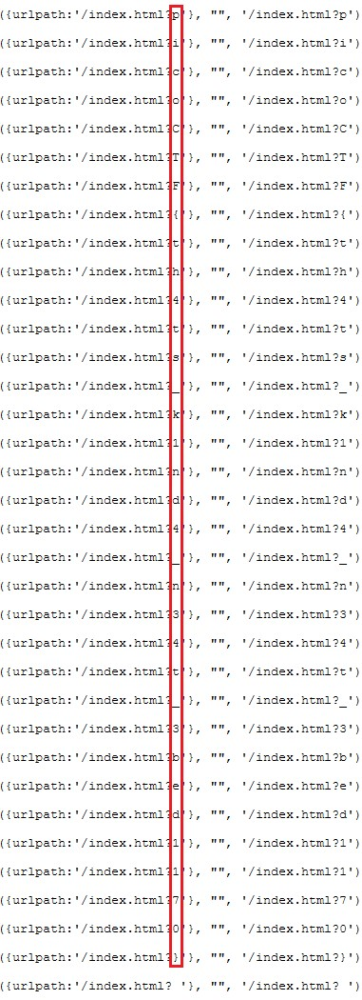

---

## Cookies

 

**Challenge Category**


**Challenge Description**

```
Author: madStacks
Description

Who doesn't love cookies? Try to figure out the best one. http://mercury.picoctf.net:27177/
```

**Flag**

```
picoCTF{3v3ry1_l0v3s_c00k135_064663be}
```

### Summary

Brute force the cookie with numbers, starting from 0, until you find the flag.

### Solution

When we look at the requests in `BurpSuite`, we see there is a `Cookie` with `name=-1`. Let's see what happens if we send it with another number.

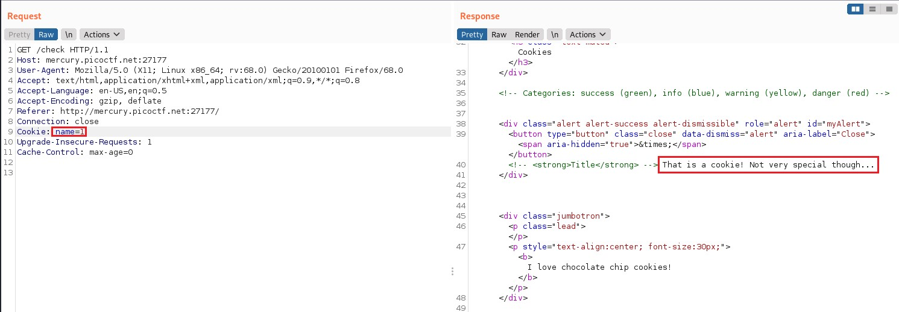

Okay... We got something, but not a flag. Let's try another number and see what happens:

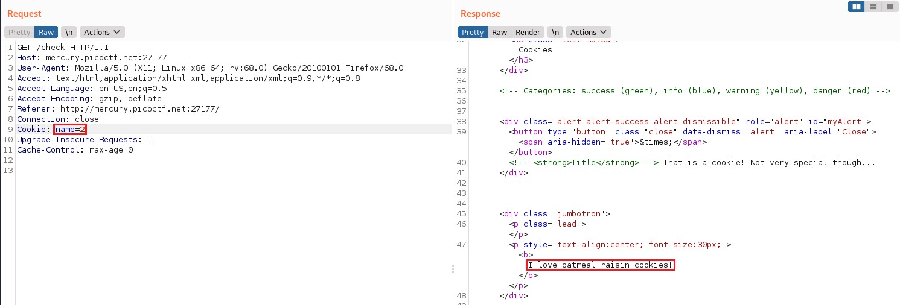

Interesting, we got a different response. Let's try brute forcing the numbers and see what kind of responses we get. We can do this by sending the request to BurpSuite's `Intruder` by pressing `Ctrl+I`. First we go to the `Positions` tab to tell `BurpSuite` what field we want to attack:

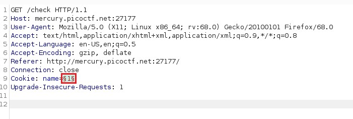

Next we set the payload in the `Payloads` tab. Pick whatever number you want, but 50 should be more than enough:

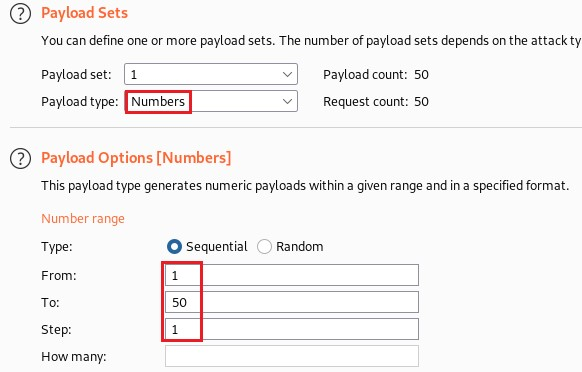

Finally (this step isn't required but will save you time from having to parse the responses), we go to the `Options` tab to set some regex `Grep - Match` statements. I added a regex statement to search for the flag format, in case it ever shows up.

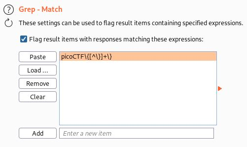

Now we're ready to start the attack. After letting it run for a bit, we see this:

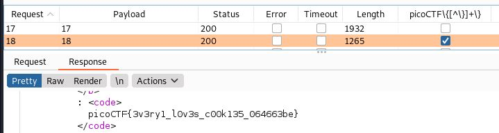

---

## Easy Peasy

 

**Challenge Category**


**Challenge Description**

```
Author: madStacks
Description

A one-time pad is unbreakable, but can you manage to recover the flag? (Wrap with picoCTF{})
nc mercury.picoctf.net 20266
```

**Challenge Files**

[otp.py](files/easy_peasy/otp.py)

**Flag**

```
picoCTF{99072996e6f7d397f6ea0128b4517c23}
```

### Solution

For this challenge, we are provided the source code for the program. If we look at the source code, we see that it is reading from a `key` file to encrypt the flag. After encrypting 50000 characters, it starts over from the beginning of the file. This allows us to retrieve the flag because we can recover the key by having it encrypt a string that we control.

```python
from pwn import *


KEY_LEN = 50000
host = "mercury.picoctf.net"
port = 20266

context.log_level = "warn"
def reset_key(conn):
    key = KEY_LEN - len(flag)
    conn.sendline(b'A' * key)
    conn.recvuntil(b"Here ya go!\n")
    data = bytes.fromhex(conn.recvuntil(b'\n').decode())
    assert len(data) == key, "Something went wrong..."

def get_key(conn):
    r.recvuntil(b"encrypt? ")
    r.sendline('A' * len(flag))
    conn.recvuntil(b"Here ya go!\n")
    enc = bytes.fromhex(conn.recvuntil(b'\n').decode())
    key = bytes([c^ord('A') for c in enc])
    return key

def decrypt(flag, key):
    msg = ''.join([chr(f ^ k) for f, k in zip(flag, key)])
    return msg


if __name__ == "__main__":
    r = remote(host, port)
    r.recvuntil(b"encrypted flag!\n")
    flag = bytes.fromhex(r.recvuntil(b'\n').decode())
    reset_key(r)
    key = get_key(r)
    flag = decrypt(flag, key)
    print(f"picoCTF{{{flag}}}")
```

---

## GET aHEAD

 

**Challenge Category**


**Challenge Description**

```
Author: madStacks
Description

Find the flag being held on this server to get ahead of the competition http://mercury.picoctf.net:47967/
```

**Flag**

```
picoCTF{r3j3ct_th3_du4l1ty_cca66bd3}
```

### Solution

Going by the name of the challenge, we try sending a `HEAD` request to the server:

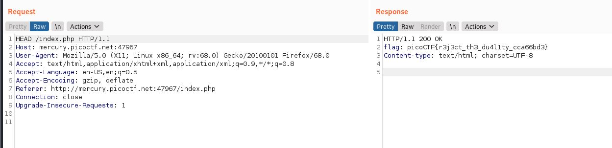

---

## information

 

**Challenge Category**


**Challenge Description**

```
Author: susie
Description

Files can always be changed in a secret way. Can you find the flag?
```

**Challenge Files**

[cat.jpg](files/information/cat.jpg)

**Flag**

```
picoCTF{the_m3tadata_1s_modified}
```

### Solution

The flag is a base64 encoded string in the file. Decode the string to get the flag.

```bash
$ strings cat.jpg
...
  <cc:license rdf:resource='cGljb0NURnt0aGVfbTN0YWRhdGFfMXNfbW9kaWZpZWR9'/>
...
```

```bash
$ echo cGljb0NURnt0aGVfbTN0YWRhdGFfMXNfbW9kaWZpZWR9 | base64 -d
picoCTF{the_m3tadata_1s_modified}
```

---

## MacroHard WeakEdge

 

**Challenge Category**


**Challenge Description**

```
Author: madStacks
Description

I've hidden a flag in this file. Can you find it? Forensics is fun.pptm
```

**Challenge Files**

[Forensics is fun.pptm](files/macrohard_weakedge/Forensics%20is%20fun.pptm)

**Flag**

```
picoCTF{D1d_u_kn0w_ppts_r_z1p5}
```

### Solution

For this challenge, we are given a damaged powerpoint file. Powerpoint files can be unzipped to be manually inspected. When you unzip the file and dig around, you find a file named `hidden` in the `slideMasters` folder.

```bash
$ ls -laR
...
./ppt/slideMasters:
total 32
drwxr-xr-x 3 root root  4096 Mar 17 23:29 .
drwxr-xr-x 7 root root  4096 Mar 17 23:29 ..
-rw-r--r-- 1 root root    99 Oct 23 14:31 hidden
drwxr-xr-x 2 root root  4096 Mar 17 23:29 _rels
-rw-r--r-- 1 root root 13875 Jan  1  1980 slideMaster1.xml
...
```

Let's see what's in it:

```bash
$ cat ppt/slideMasters/hidden
Z m x h Z z o g c G l j b 0 N U R n t E M W R f d V 9 r b j B 3 X 3 B w d H N f c l 9 6 M X A 1 f Q
```

This looks like it could be a base64 string with spaces in between each character. Let's see what it decodes to:

```bash
$ base64 -id ppt/slideMasters/hidden
flag: picoCTF{D1d_u_kn0w_ppts_r_z1p5}
```

---

## Magikarp Ground Mission

 

**Challenge Category**


**Challenge Description**

```
Author: syreal
Description

Do you know how to move between directories and read files in the shell? Start the container, `ssh` to it, and then `ls` once connected to begin. Login via `ssh` as `ctf-player` with the password, `abcba9f7`
```

**Flag**

```
picoCTF{xxsh_0ut_0f_\/\/4t3r_21cac893}
```

### Solution

The flag is split into three parts. Follow the instructions to get to the next part of the flag.

```bash
$ ls
1of3.flag.txt  instructions-to-2of3.txt
$ cat 1of3.flag.txt
picoCTF{xxsh_
$ cat instructions-to-2of3.txt
Next, go to the root of all things, more succinctly `/`
$ ls /
2of3.flag.txt  dev   instructions-to-3of3.txt  media  proc  sbin  tmp
bin            etc   lib                       mnt    root  srv   usr
boot           home  lib64                     opt    run   sys   var
$ cat /2of3.flag.txt
0ut_0f_\/\/4t3r_
$ cat /instructions-to-3of3.txt
Lastly, ctf-player, go home... more succinctly `~`
$ ls ~
3of3.flag.txt  drop-in
$ cat ~/3of3.flag.txt
21cac893}
```

---

## Matryoshka doll

 

**Challenge Category**


**Challenge Description**

```
Author: Susie/Pandu
Description

Matryoshka dolls are a set of wooden dolls of decreasing size placed one inside another. What's the final one?
```

**Challenge Files**

[dolls.jpg](files/matryoshka_doll/dolls.jpg)

**Flag**

```
picoCTF{336cf6d51c9d9774fd37196c1d7320ff}
```

### Solution

We can solve this challenge using a tool named `binwalk` to extract embedded files. `binwalk` also has the option `-M` for recursive extraction.

```bash
$ binwalk -Me dolls.jpg
...
DECIMAL       HEXADECIMAL     DESCRIPTION
--------------------------------------------------------------------------------
0             0x0             PNG image, 320 x 768, 8-bit/color RGBA, non-interlaced
3226          0xC9A           TIFF image data, big-endian, offset of first image directory: 8
79578         0x136DA         Zip archive data, at least v2.0 to extract, compressed size: 64, uncompressed size: 81, name: flag.txt
79786         0x137AA         End of Zip archive, footer length: 22

```

From the output of `binwalk`, we see there is an extracted file named `flag.txt`. `cat` the file to get the flag.

---

## Mind your Ps and Qs

 

**Challenge Category**


**Challenge Description**

```
Author: Sara
Description

In RSA, a small e value can be problematic, but what about N? Can you decrypt this?
```

**Challenge Files**

[values](files/mind_your_ps_and_qs/values)

**Flag**

```
picoCTF{sma11_N_n0_g0od_23540368}
```

### Solution

Factor the `n` to retrieve `p` and `q` using [FactorDB](http://factordb.com/index.php?query=831416828080417866340504968188990032810316193533653516022175784399720141076262857). Decrypt flag using normal RSA functions.

```python
from Crypto.Util.number import inverse, long_to_bytes


n = 831416828080417866340504968188990032810316193533653516022175784399720141076262857
e = 65537
c = 240986837130071017759137533082982207147971245672412893755780400885108149004760496

# Values from FactorDB
p = 1593021310640923782355996681284584012117
q = 521911930824021492581321351826927897005221

phin = (p-1) * (q-1)
d = modinv(e, phin)
m = pow(c, d, n)
print(long_to_bytes(m).decode())
```

---

## Mod 26

 

**Challenge Category**


**Challenge Description**

```
Author: Pandu
Description

Cryptography can be easy, do you know what ROT13 is? cvpbPGS{arkg_gvzr_V'yy_gel_2_ebhaqf_bs_ebg13_GYpXOHqX}
```

**Flag**

```
picoCTF{next_time_I'll_try_2_rounds_of_rot13_TLcKBUdK}
```

### Solution

Use a tool, such as [CyberChef](https://gchq.github.io/CyberChef/#recipe=ROT13(true,true,false,13)), to decrypt the flag using `ROT13`.

---

## New Caesar

 

**Challenge Category**


**Challenge Description**

```
Author: madStacks
Description

We found a brand new type of encryption, can you break the secret code? (Wrap with picoCTF{})
kjlijdliljhdjdhfkfkhhjkkhhkihlhnhghekfhmhjhkhfhekfkkkjkghghjhlhghmhhhfkikfkfhm
```

**Challenge Files**

[new_caesar.py](files/new_caesar/new_caesar.py)

**Flag**

```
picoCTF{et_tu?_1ac5f3d7920a85610afeb2572831daa8}
```

### Solution

For this challenge, we are given a [script](files/new_caesar/new_caesar.py) which uses a custom encryption scheme to encrypt the flag. To recover the flag, we will need to reverse engineer the functions.

We start off by analyzing the first function:

```python
ALPHABET = string.ascii_lowercase[:16]

def b16_encode(plain):
    enc = ""
    for c in plain:
        binary = "{0:08b}".format(ord(c))
        enc += ALPHABET[int(binary[:4], 2)]
        enc += ALPHABET[int(binary[4:], 2)]
    return enc
```

In this function, it takes each character in the provided string and splits it into two nibbles. It then uses the nibbles to determine what index of `ALPHABET` to add to the encrypted string.

Now let's see what the second function is doing:

```python
def shift(c, k):
    t1 = ord(c) - LOWERCASE_OFFSET
    t2 = ord(k) - LOWERCASE_OFFSET
    return ALPHABET[(t1 + t2) % len(ALPHABET)]
```

This function takes a string, `c`, and shifts it down the `ALPHABET` by `k` letters, similar to how a ROT13 cipher works.

And finally, let's see how it's encrypting the flag. Maybe we can get some useful information to help us narrow down the keyspace.

```python
assert all([k in ALPHABET for k in key])
assert len(key) == 1

b16 = b16_encode(flag)
enc = ""
for i, c in enumerate(b16):
    enc += shift(c, key[i % len(key)])
print(enc)
```

The important thing to take away from this is `assert len(key) == 1`. This means that the key is just a single character, which also means each character in the encrypted string was rotated by the same amount.

With this information, we can now write a script to decrypt the flag by bruteforcing the key.

```python
#!/usr/bin/env python3
import string


LOWERCASE_OFFSET = ord("a")
ALPHABET = string.ascii_lowercase[:16]

enc = "kjlijdliljhdjdhfkfkhhjkkhhkihlhnhghekfhmhjhkhfhekfkkkjkghghjhlhghmhhhfkikfkfhm"
def b16_decode(enc):
    plain = ""
    letters = [enc[i:i+2] for i in range(0, len(enc), 2)]
    for n1, n2 in letters:
        letter = ALPHABET.index(n1) * 0x10
        letter |= ALPHABET.index(n2)
        plain += chr(letter)
    return plain

def unshift(c, k):
    t1 = ord(c) - LOWERCASE_OFFSET
    t2 = ord(k) - LOWERCASE_OFFSET
    return ALPHABET[(t1 - t2) % len(ALPHABET)]

for k in ALPHABET:
    b16 = ''.join(unshift(c, k) for c in enc)
    dec = b16_decode(b16)
    if dec.isascii() and dec.isprintable():
        print(f"Key: {k}\nDecrypted message: {dec}")
```

When we run this script, we are left with 2 candidates, with one as the obvious winner.

```bash
$ ./solve.py
Key: e
Decrypted message: et_tu?_1ac5f3d7920a85610afeb2572831daa8
Key: f
Decrypted message: TcNcd.N PR$U"S&(!/P'$% /PUTQ!$&!'" SPP'
```

---

## Nice netcat...

 

**Challenge Category**


**Challenge Description**

```
Author: syreal
Description

There is a nice program that you can talk to by using this command in a shell: $ nc mercury.picoctf.net 22902, but it doesn't speak English...
```

**Flag**

```
picoCTF{g00d_k1tty!_n1c3_k1tty!_d3dfd6df}
```

### Solution

When you connect to the server, it responds with a series of integers:

```bash
$ nc mercury.picoctf.net 22902
112
105
99
111
67
84
70
123
103
48
48
100
95
107
49
116
116
121
33
95
110
49
99
51
95
107
49
116
116
121
33
95
100
51
100
102
100
54
100
102
125
10
```

Take the integers and use a tool, such as [CyberChef](https://gchq.github.io/CyberChef/#recipe=From_Decimal('Space',false)), to convert it from decimal to ascii.

---

## Obedient Cat

 

**Challenge Category**


**Challenge Description**

```
Author: syreal
Description

This file has a flag in plain sight (aka "in-the-clear").
```

**Challenge Files**

[flag](files/obedient_cat/flag)

**Flag**

```
picoCTF{s4n1ty_v3r1f13d_28e8376d}
```

### Solution

Run `cat` on the file.

```bash
$ cat flag
picoCTF{s4n1ty_v3r1f13d_28e8376d}
```

---

## Python Wrangling

 

**Challenge Category**


**Challenge Description**

```
Author: syreal
Description

Python scripts are invoked kind of like programs in the Terminal... Can you run this Python script using this password to get the flag?
```

**Challenge Files**

[ende.py](files/python_wrangling/ende.py)\
[flag.txt.en](files/python_wrangling/flag.txt.en)\
[pw.txt](files/python_wrangling/pw.txt)

**Flag**

```
picoCTF{4p0110_1n_7h3_h0us3_dbd1bea4}
```

### Solution

Use the [ende.py](files/python_wrangling/ende.py) to decrypt [flag.txt.en](files/python_wrangling/flag.txt.en) using the password provided in [pw.txt](files/python_wrangling/pw.txt).

```bash
$ cat pw.txt
dbd1bea4dbd1bea4dbd1bea4dbd1bea4
$ python ende.py -d flag.txt.en
Please enter the password:dbd1bea4dbd1bea4dbd1bea4dbd1bea4
picoCTF{4p0110_1n_7h3_h0us3_dbd1bea4}
```

---

## Scavenger Hunt

 

**Challenge Category**


**Challenge Description**

```
Author: madStacks
Description

There is some interesting information hidden around this site http://mercury.picoctf.net:39491/. Can you find it?
```

**Challenge Files**

[File](link)

**Flag**

```
picoCTF{th4ts_4_l0t_0f_pl4c3s_2_lO0k_f7ce8828}
```

### Summary

The flag is broken down into five parts.

Part 1 can be found in the site's source code.\
Part 2 can be found at `http://mercury.picoctf.net:39491/mycss.css`.\
Part 3 can be found at `http://mercury.picoctf.net:39491/robots.txt`.\
Part 4 can be found at `http://mercury.picoctf.net:39491/.htaccess`.\
Part 5 can be found at `http://mercury.picoctf.net:39491/.DS_Store`.

### Solution

When connecting to the site, we see a pretty basic site with two tabs, `How` and `What`. When we check the `What` tab, we see this:

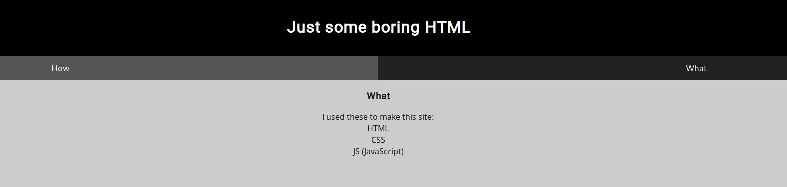

This hints at 3 different files, the first one being the site's HTML code. We can check this by viewing the source code of the site.

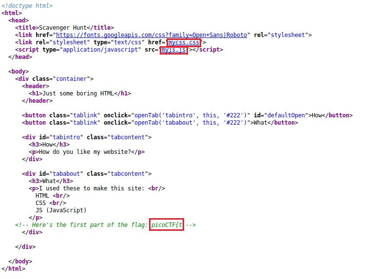

If we look at the top of the source code, it shows links to two files: [mycss.css](http://mercury.picoctf.net:39491/mycss.css) and [myjs.js](http://mercury.picoctf.net:39491/myjs.js). If we follow the links, we see this:

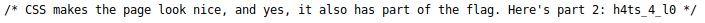

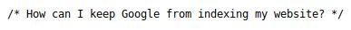

The second snippet is referencing the [robots.txt](http://mercury.picoctf.net:39491/robots.txt) file.

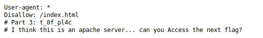

This next part points us towards the [.htaccess](http://mercury.picoctf.net:39491/.htaccess) file.

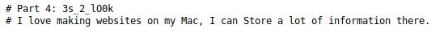

And finally, this last part hints towards the [.DS_Store](http://mercury.picoctf.net:39491/.DS_Store) file.

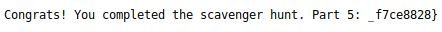

---

## Static ain't always noise

 

**Challenge Category**


**Challenge Description**

```
Author: syreal
Description

Can you look at the data in this binary: static? This BASH script might help!
```

**Challenge Files**

[ltdis.sh](files/static_aint_always_noise/ltdis.sh)\
[static](files/static_aint_always_noise/static)

**Flag**

```
picoCTF{d15a5m_t34s3r_ccb2b43e}
```

### Solution

Dump the `.data` section in [static](files/static_aint_always_noise/static) to get the flag.

```bash
$ objdump -sj .data static

static:     file format elf64-x86-64

Contents of section .data:
 201000 00000000 00000000 08102000 00000000  .......... .....
 201010 00000000 00000000 00000000 00000000  ................
 201020 7069636f 4354467b 64313561 356d5f74  picoCTF{d15a5m_t
 201030 33347333 725f6363 62326234 33657d00  34s3r_ccb2b43e}.
```

---

## Tab, Tab, Attack

 

**Challenge Category**


**Challenge Description**

```
Author: syreal
Description

Using tabcomplete in the Terminal will add years to your life, esp. when dealing with long rambling directory structures and filenames: Addadshashanammu.zip
```

**Challenge Files**

[Addadshashanammu.zip](files/tab_tab_attack/Addadshashanammu.zip)

**Flag**

```
picoCTF{l3v3l_up!_t4k3_4_r35t!_d32e018c}
```

### Solution

Unzip the file and `grep` for the flag format.

```bash
$ unzip -q Addadshashanammu.zip
$ egrep -aoir 'picoCTF\{[^\}]+\}' Addadshashanammu
Addadshashanammu/Almurbalarammi/Ashalmimilkala/Assurnabitashpi/Maelkashishi/Onnissiralis/Ularradallaku/fang-of-haynekhtnamet:picoCTF{l3v3l_up!_t4k3_4_r35t!_d32e018c}
```

---

## Trivial Flag Transfer Protocol

 

**Challenge Category**


**Challenge Description**

```
Author: Danny
Description

Figure out how they moved the flag.
```

**Challenge Files**

[tftp.pcapng](files/trivial_flag_transfer_protocol/tftp.pcapng)

**Flag**

```
picoCTF{h1dd3n_1n_pLa1n_51GHT_18375919}
```

### Summary

The flag is hidden within an image using `steghide`. The password used to hide the file is contained within another text file using `ROT13`.

### Solution

In this challenge, we are provided with a pcap of TFTP data. We start off by extracting all the files from the TFTP data. We can do this with `tshark`:

```bash
$ tshark -nr tftp.pcapng --export-objects `tftp,extracted_files'
$ ls extracted_files
instructions.txt  picture1.bmp  picture2.bmp  picture3.bmp  plan  program.deb
```

While looking through the contents of the extracted files, we see a couple interesting files, `instructions.txt`, and `plan`.

Let's see what's in them:

```bash
$ cat instructions.txt
GSGCQBRFAGRAPELCGBHEGENSSVPFBJRZHFGQVFTHVFRBHESYNTGENAFSRE.SVTHERBHGNJNLGBUVQRGURSYNTNAQVJVYYPURPXONPXSBEGURCYNA
$ cat plan
VHFRQGURCEBTENZNAQUVQVGJVGU-QHRQVYVTRAPR.PURPXBHGGURCUBGBF
```

After some investigating, we find out that these two strings were encoded in `ROT13`. This is what they translate to:

```
TFTPDOESNTENCRYPTOURTRAFFICSOWEMUSTDISGUISEOURFLAGTRANSFER.FIGUREOUTAWAYTOHIDETHEFLAGANDIWILLCHECKBACKFORTHEPLAN

IUSEDTHEPROGRAMANDHIDITWITH-DUEDILIGENCE.CHECKOUTTHEPHOTOS
```

Looks like we found a password: `DUEDILIGENCE`. Now we just have to figure out how to use it. If we look into the `program.deb`, we find out it is the package for `steghide`. This makes sense because we also extracted three images from the data. If we try using this password on each file, we eventually find one that the password works on:

```bash
$ steghide extract -sf picture1.bmp
Enter passphrase:
steghide: could not extract any data with that passphrase!
$ steghide extract -sf picture2.bmp
Enter passphrase:
steghide: could not extract any data with that passphrase!
$ steghide extract -sf picture3.bmp
Enter passphrase:
wrote extracted data to "flag.txt".
$ cat flag.txt
picoCTF{h1dd3n_1n_pLa1n_51GHT_18375919}
```

---

## tunn3l v1s10n

 

**Challenge Category**


**Challenge Description**

```
Author: Danny
Description

We found this file. Recover the flag.
```

**Challenge Files**

[tunn3l_v1s10n](files/tunn3l_v1s10n/tunn3l_v1s10n)

**Flag**

```
picoCTF{qu1t3_a_v13w_2020}
```

### Solution

For this challenge, we are given a file which *appears* to be junk data. However, upon inspecting the file in a hex editor, we see that it contains the file signature for a bitmap image. My preferred hex editor is `010 Editor` because it has templates to neatly parse and highlight header information for all kinds of file formats.

When we apply the BMP template, we see this:

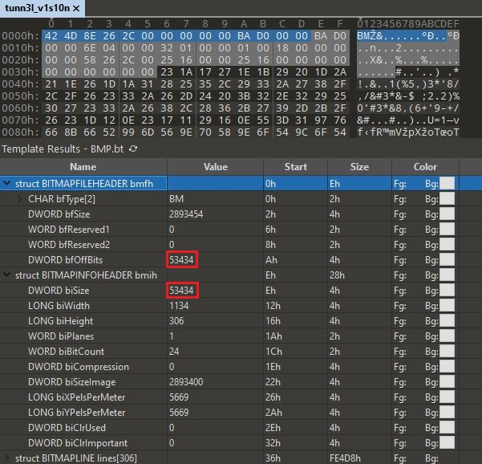

If we look at documentation for the [BMP file format](http://www.ece.ualberta.ca/~elliott/ee552/studentAppNotes/2003_w/misc/bmp_file_format/bmp_file_format.htm), we see that some things don't add up to what they're supposed to be. The `bfOffset` section in the header should point to the beginning of the bitmap data, and the `biSize` should equal the size of the `BITMATINFOHEADER`.

After we repair those sections...

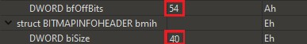

 we see this:


We got the image to open properly, but we're still not there yet. Since the title of the channel was tunnel vision, I figured the size of the image was modified to show part of the full image. After a bit of tinkering with the image size, we find this:


### References

[THE BMP FILE FORMAT](http://www.ece.ualberta.ca/~elliott/ee552/studentAppNotes/2003_w/misc/bmp_file_format/bmp_file_format.htm)

---

## Wave a flag

 

**Challenge Category**


**Challenge Description**

```
Author: syreal
Description

Can you invoke help flags for a tool or binary? This program has extraordinarily helpful information...
```

**Challenge Files**

[warm](files/wave_a_flag/warm)

**Flag**

```
picoCTF{b1scu1ts_4nd_gr4vy_18788aaa}
```

### Solution

Use `grep` to find the flag.

```bash
$ egrep -aio 'picoCTF\{[^\}]+\}' warm
picoCTF{b1scu1ts_4nd_gr4vy_18788aaa}
```

---

## Weird File

 

**Challenge Category**


**Challenge Description**

```
Author: thelshell
Description

What could go wrong if we let Word documents run programs? (aka "in-the-clear").
```

**Challenge Files**

[weird.docm](files/weird_file/weird.docm)

**Flag**

```
picoCTF{m4cr0s_r_d4ng3r0us}
```

### Solution

The flag is hidden within an embedded macro in the file. Extract the macro and decode the base64 string in the function.

```bash
$ olevba -c weird.docm
olevba 0.56 on Python 3.8.6 - http://decalage.info/python/oletools
===============================================================================
FILE: weird.docm
Type: OpenXML
WARNING  For now, VBA stomping cannot be detected for files in memory
-------------------------------------------------------------------------------
VBA MACRO ThisDocument.cls
in file: word/vbaProject.bin - OLE stream: 'VBA/ThisDocument'
- - - - - - - - - - - - - - - - - - - - - - - - - - - - - - - - - - - - - - -
Sub AutoOpen()
    MsgBox "Macros can run any program", 0, "Title"
    Signature

End Sub

 Sub Signature()
    Selection.TypeText Text:="some text"
    Selection.TypeParagraph

 End Sub

 Sub runpython()

Dim Ret_Val
Args = """" '"""
Ret_Val = Shell("python -c 'print(\"cGljb0NURnttNGNyMHNfcl9kNG5nM3IwdXN9\")'" & " " & Args, vbNormalFocus)
If Ret_Val = 0 Then
   MsgBox "Couldn't run python script!", vbOKOnly
End If
End Sub

$ echo cGljb0NURnttNGNyMHNfcl9kNG5nM3IwdXN9 | base64 -d
picoCTF{m4cr0s_r_d4ng3r0us}
```

---

## Wireshark doo dooo do doo...

 

**Challenge Category**


**Challenge Description**

```
Author: Dylan
Description

Can you find the flag? shark1.pcapng.
```

**Challenge Files**

[shark1.pcapng](files/wireshark_doo_dooo_do_doo/shark1.pcapng)

**Flag**

```
picoCTF{p33kab00_1_s33_u_deadbeef}
```

### Solution

While inspecting the TCP streams, we see this in stream 5:

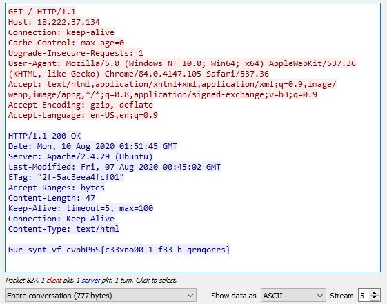

This looks a lot like our flag format, but encoded in ROT13. Decode it to get the flag.
